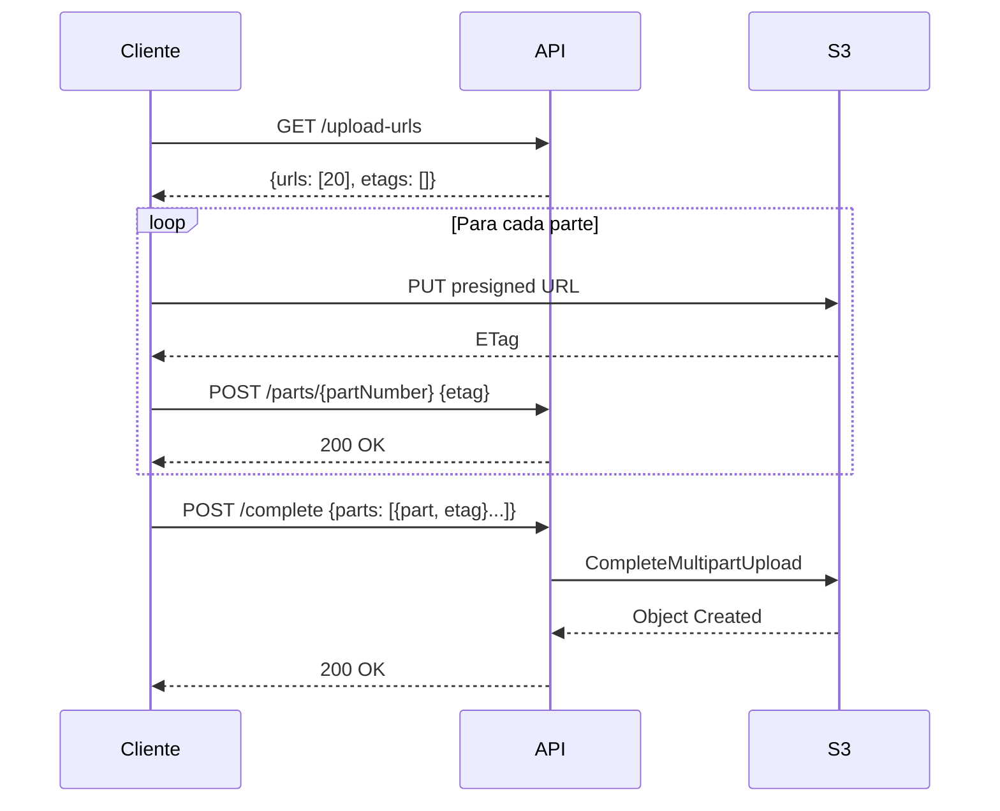
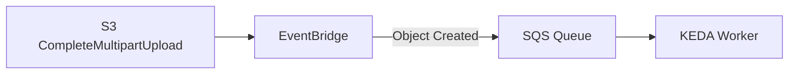
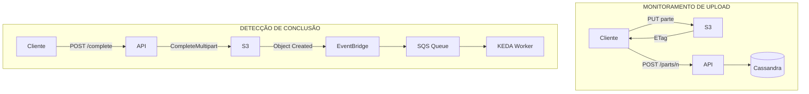
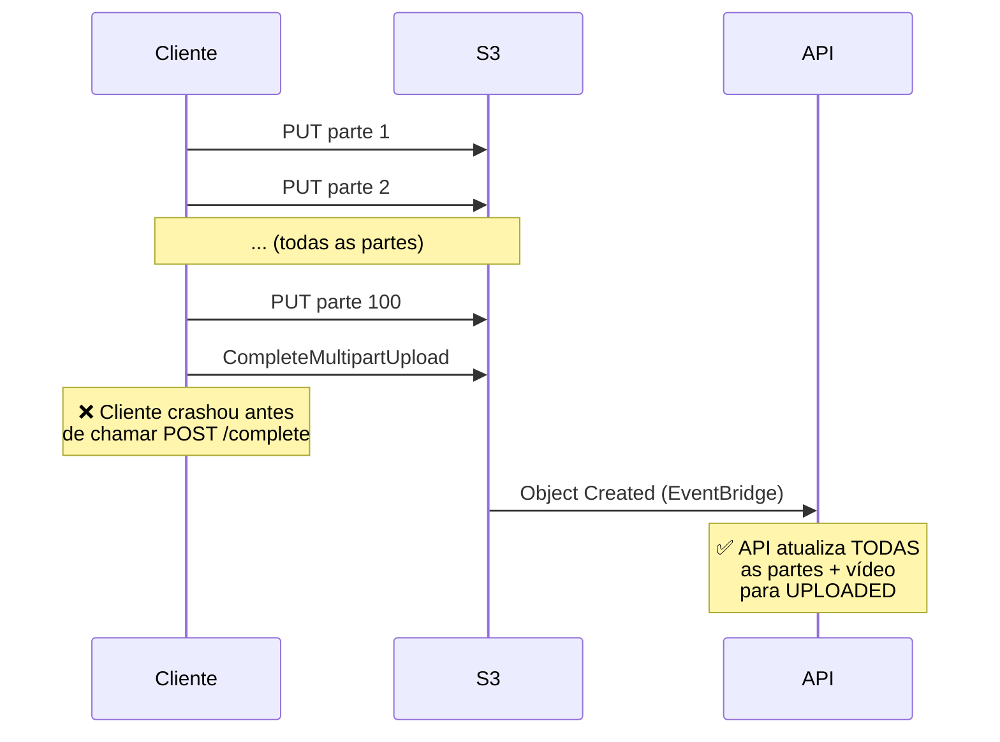
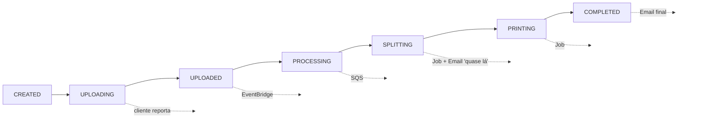
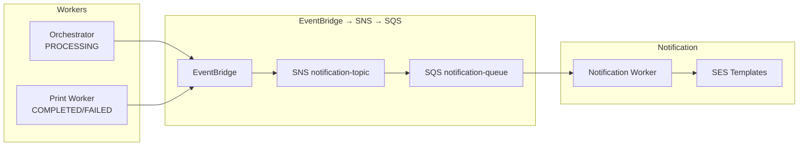

# ADR 007 — Monitoramento de Upload e Eventos via EventBridge + SQS

| Campo      | Valor                |
|------------|----------------------|
| Status     | Aceito               |
| Data       | 2026-01-17           |
| Autor      | Arão Freitas         |

## Contexto

O sistema precisa:

1. **Monitorar progresso de uploads multipart** em tempo real
2. **Detectar conclusão do upload** para disparar processamento
3. **Detectar uploads abandonados** ou com falha

### Limitação do S3 EventBridge

**IMPORTANTE**: O S3 **NÃO emite eventos para cada parte individual** (`UploadPart`).

Eventos S3 disponíveis via EventBridge:

| Evento S3 | EventBridge Detail Type | Disponível? |
|-----------|------------------------|-------------|
| `UploadPart` | - | **NÃO** |
| `CompleteMultipartUpload` | Object Created | **SIM** |
| `AbortMultipartUpload` | - | **NÃO** (apenas via API) |
| `PutObject` | Object Created | SIM |

Fonte: [S3 Event Notifications to EventBridge](https://docs.aws.amazon.com/AmazonS3/latest/userguide/EventBridge.html)

## Decisão

### 1. Monitoramento de Progresso: **Cliente Reporta**

Como o S3 não emite eventos por parte, o **cliente deve reportar** o progresso após cada upload bem-sucedido:



### 2. Detecção de Conclusão: **EventBridge**

Usar EventBridge apenas para detectar `CompleteMultipartUpload`:



### 3. Arquitetura Final



## Endpoints Necessários

| Endpoint | Método | Descrição |
|----------|--------|-----------|
| `/videos` | POST | Cria vídeo, retorna uploadId |
| `/videos/{id}/upload-urls` | GET | Retorna batch de 20 URLs |
| `/videos/{id}/parts/{partNumber}` | POST | **Reporta ETag após upload** |
| `/videos/{id}/progress` | GET | Consulta progresso atual |
| `/videos/{id}/complete` | POST | Finaliza multipart upload |

### Payload: Reportar Parte

```json
POST /videos/{id}/parts/1
{
  "etag": "\"d41d8cd98f00b204e9800998ecf8427e\""
}
```

### Payload: Consultar Progresso

```json
GET /videos/{id}/progress

Response:
{
  "videoId": "uuid",
  "status": "UPLOADING",
  "totalParts": 100,
  "uploadedParts": 45,
  "percentage": 45,
  "parts": [
    {"partNumber": 1, "etag": "abc", "uploadedAt": "2026-01-17T10:00:00Z"},
    {"partNumber": 2, "etag": "def", "uploadedAt": "2026-01-17T10:00:01Z"}
  ]
}
```

## Regra EventBridge

```json
{
  "source": ["aws.s3"],
  "detail-type": ["Object Created"],
  "detail": {
    "bucket": { "name": ["fiapx-videos"] },
    "reason": ["CompleteMultipartUpload"]
  }
}
```

## Reconciliação: CompleteMultipartUpload como Fonte de Verdade

**Ponto crítico**: Se o S3 emite o evento `CompleteMultipartUpload`, significa que **todas as partes foram enviadas com sucesso**. O S3 só aceita completar o upload se todas as partes estiverem presentes.

### Cenário de Falha do Cliente



### Lógica de Reconciliação

Quando o evento `CompleteMultipartUpload` chega via EventBridge:

1. **Buscar vídeo** pelo `object.key` (videoId)
2. **Se status < UPLOADED**:
   - Atualizar **todas as partes** que faltam para `status: UPLOADED`
   - Atualizar **vídeo** para `status: UPLOADED`
3. **Publicar na SQS Split** para iniciar processamento

### Por que isso é importante?

| Cenário | Sem Reconciliação | Com Reconciliação |
|---------|-------------------|-------------------|
| Cliente não reportou partes | Vídeo fica UPLOADING para sempre | Vídeo vai para UPLOADED |
| Cliente crashou | Processamento não inicia | Processamento inicia normalmente |
| Rede instável | Partes ficam pendentes | Partes marcadas como OK |
| App fechou antes de /complete | Dados inconsistentes | Dados consistentes |

### Garantia do S3

O `CompleteMultipartUpload` só retorna sucesso se:
- Todas as partes especificadas existem no S3
- Os ETags de todas as partes conferem
- O objeto final foi criado com sucesso

**Se o evento chegou, o upload está 100% completo no S3.**

## Consequências

### Positivas

- **Arquitetura correta**: Não depende de eventos inexistentes
- **Progresso real-time**: Cliente reporta imediatamente após cada parte
- **ETags coletados**: Necessários para CompleteMultipartUpload
- **Desacoplamento**: EventBridge dispara processamento sem polling
- **Resiliência**: SQS com retry e DLQ

### Negativas

- Cliente precisa fazer 1 request adicional por parte (POST /parts/{n})
- Overhead de ~100 requests extras para vídeo de 100 partes
- Se cliente não reportar, progresso fica desatualizado, ate que receba o evento `CompleteMultipartUpload`

## Fluxo de Status



### Transições de Status

| Trigger | Status Anterior | Status Novo | Notificação |
|---------|-----------------|-------------|-------------|
| POST /videos | - | CREATED | - |
| GET /upload-urls (primeira vez) | CREATED | UPLOADING | - |
| POST /parts/{n} | UPLOADING | UPLOADING | - |
| POST /complete | UPLOADING | UPLOADED | - |
| EventBridge → SQS | UPLOADED | PROCESSING | - |
| Split Job concluído | PROCESSING | SPLITTING | **Email: "Quase lá"** |
| Print Job concluído | SPLITTING | COMPLETED | **Email: "Concluído"** |
| Timeout/Erro | * | FAILED | **Email: "Falha"** |

## Notificações por Email (EventBridge → SNS → SQS → SES)

O sistema envia notificações em momentos-chave usando **SES Templates** via **SNS → SQS → Notification Worker**.

> **Nota**: A arquitetura de notificações foi migrada de API Destination para SNS fan-out.
> Ver ADR 014 para justificativa completa.

### Arquitetura de Notificações



### Regra EventBridge para Notificações

```json
{
  "source": ["fiapx.video"],
  "detail-type": ["Video Status Changed"],
  "detail": {
    "status": ["PROCESSING", "COMPLETED", "FAILED"]
  }
}
```

## Custos (10.000 vídeos/mês)

| Componente | Uso | Custo |
|------------|-----|-------|
| EventBridge (Object Created) | 10k eventos | $0.01 |
| EventBridge (Status Changed) | 30k eventos | $0.03 |
| SQS (Split Queue) | 10k mensagens | $0.004 |
| SQS (Print Queue) | 100k mensagens | $0.04 |
| SES (emails) | 30k emails | $0.30 |
| SNS (publicações) | 30k publicações | Grátis (free tier) |
| SNS → SQS (entregas) | 30k entregas | Grátis |
| API Requests (partes) | 1M requests | Incluso na API |
| **Total** | - | **~$0.38** |

## Alternativas Consideradas

1. **Polling S3 ListParts**: Descartado por custo alto ($0.005/1000 requests) e latência
2. **S3 Event para cada parte**: **Não existe** - S3 não emite eventos para UploadPart
3. **WebSocket para progresso**: Descartado por complexidade sem benefício claro
4. **Lambda intermediário**: Descartado por cold start e custo (ADR 002)

## Referências

- [S3 Event Notifications to EventBridge](https://docs.aws.amazon.com/AmazonS3/latest/userguide/EventBridge.html)
- [EventBridge S3 Event Mapping](https://docs.aws.amazon.com/AmazonS3/latest/userguide/ev-mapping-troubleshooting.html)
- [S3 Multipart Upload](https://docs.aws.amazon.com/AmazonS3/latest/userguide/mpuoverview.html)
- [CompleteMultipartUpload API](https://docs.aws.amazon.com/AmazonS3/latest/API/API_CompleteMultipartUpload.html)
- [Amazon SQS Pricing](https://aws.amazon.com/sqs/pricing/)
- [Amazon EventBridge Pricing](https://aws.amazon.com/eventbridge/pricing/)
