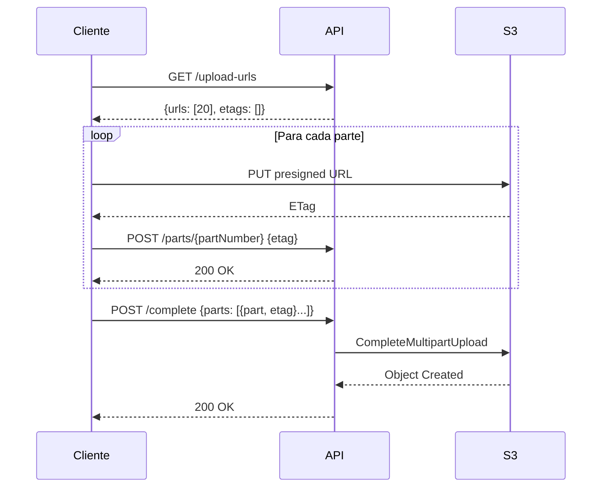
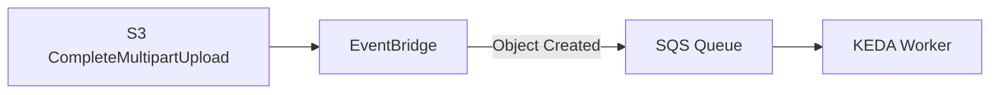
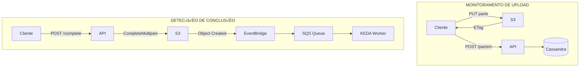
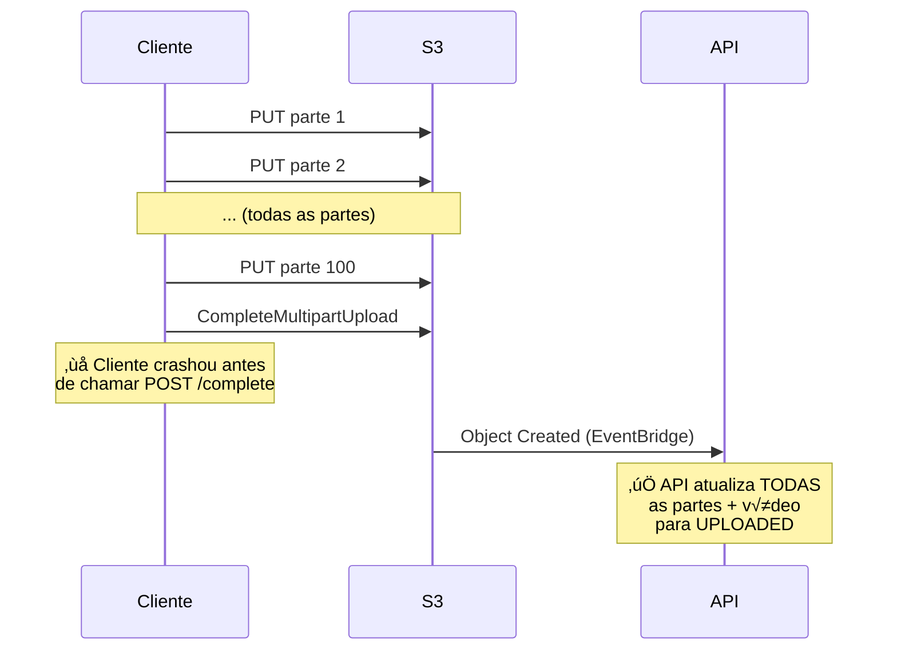
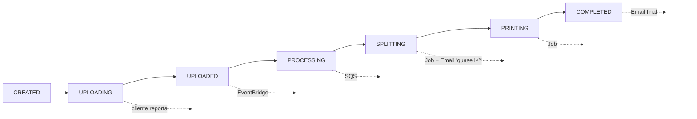
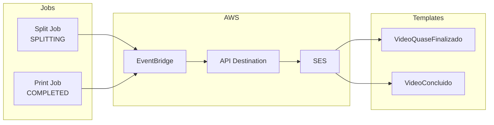

# ADR 007 — Monitoramento de Upload e Eventos via EventBridge + SQS

| Campo      | Valor                |
|------------|----------------------|
| Status     | Aceito               |
| Data       | 2026-01-17           |
| Autor      | Ar√£o Freitas         |

## Contexto

O sistema precisa:

1. **Monitorar progresso de uploads multipart** em tempo real
2. **Detectar conclus√£o do upload** para disparar processamento
3. **Detectar uploads abandonados** ou com falha

### Limitação do S3 EventBridge

**IMPORTANTE**: O S3 **NÃO emite eventos para cada parte individual** (`UploadPart`).

Eventos S3 disponíveis via EventBridge:

| Evento S3 | EventBridge Detail Type | Disponível? |
|-----------|------------------------|-------------|
| `UploadPart` | - | **NÃO** |
| `CompleteMultipartUpload` | Object Created | **SIM** |
| `AbortMultipartUpload` | - | **NÃO** (apenas via API) |
| `PutObject` | Object Created | SIM |

Fonte: [S3 Event Notifications to EventBridge](https://docs.aws.amazon.com/AmazonS3/latest/userguide/EventBridge.html)

## Decis√£o

### 1. Monitoramento de Progresso: **Cliente Reporta**

Como o S3 não emite eventos por parte, o **cliente deve reportar** o progresso após cada upload bem-sucedido:


```mermaid
sequenceDiagram
    participant Cliente
    participant API
    participant S3

    Cliente->>API: GET /upload-urls
    API-->>Cliente: {urls: [20], etags: []}

    loop Para cada parte
        Cliente->>S3: PUT presigned URL
        S3-->>Cliente: ETag
        Cliente->>API: POST /parts/{partNumber} {etag}
        API-->>Cliente: 200 OK
    end

    Cliente->>API: POST /complete {parts: [{part, etag}...]}
    API->>S3: CompleteMultipartUpload
    S3-->>API: Object Created
    API-->>Cliente: 200 OK
```

### 2. Detecção de Conclusão: **EventBridge**

Usar EventBridge apenas para detectar `CompleteMultipartUpload`:


```mermaid
flowchart LR
    S3[S3 CompleteMultipartUpload] --> EB[EventBridge]
    EB -->|Object Created| SQS[SQS Queue]
    SQS --> KEDA[KEDA Worker]
```

### 3. Arquitetura Final


```mermaid
flowchart TB
    subgraph Monitoramento["MONITORAMENTO DE UPLOAD"]
        Cliente1[Cliente] -->|PUT parte| S3_1[S3]
        S3_1 -->|ETag| Cliente1
        Cliente1 -->|POST /parts/n| API1[API]
        API1 --> Cassandra[(Cassandra)]
    end

    subgraph Conclusao["DETECÇÃO DE CONCLUSÃO"]
        Cliente2[Cliente] -->|POST /complete| API2[API]
        API2 -->|CompleteMultipart| S3_2[S3]
        S3_2 -->|Object Created| EventBridge[EventBridge]
        EventBridge --> SQS[SQS Queue]
        SQS --> KEDA[KEDA Worker]
    end
```

## Endpoints Necess√°rios

| Endpoint | Método | Descrição |
|----------|--------|-----------|
| `/videos` | POST | Cria vídeo, retorna uploadId |
| `/videos/{id}/upload-urls` | GET | Retorna batch de 20 URLs |
| `/videos/{id}/parts/{partNumber}` | POST | **Reporta ETag após upload** |
| `/videos/{id}/progress` | GET | Consulta progresso atual |
| `/videos/{id}/complete` | POST | Finaliza multipart upload |

### Payload: Reportar Parte

```json
POST /videos/{id}/parts/1
{
  "etag": "\"d41d8cd98f00b204e9800998ecf8427e\""
}
```

### Payload: Consultar Progresso

```json
GET /videos/{id}/progress

Response:
{
  "videoId": "uuid",
  "status": "UPLOADING",
  "totalParts": 100,
  "uploadedParts": 45,
  "percentage": 45,
  "parts": [
    {"partNumber": 1, "etag": "abc", "uploadedAt": "2026-01-17T10:00:00Z"},
    {"partNumber": 2, "etag": "def", "uploadedAt": "2026-01-17T10:00:01Z"}
  ]
}
```

## Regra EventBridge

```json
{
  "source": ["aws.s3"],
  "detail-type": ["Object Created"],
  "detail": {
    "bucket": { "name": ["fiapx-videos"] },
    "reason": ["CompleteMultipartUpload"]
  }
}
```

## Reconciliação: CompleteMultipartUpload como Fonte de Verdade

**Ponto crítico**: Se o S3 emite o evento `CompleteMultipartUpload`, significa que **todas as partes foram enviadas com sucesso**. O S3 só aceita completar o upload se todas as partes estiverem presentes.

### Cen√°rio de Falha do Cliente


```mermaid
sequenceDiagram
    participant Cliente
    participant S3
    participant API

    Cliente->>S3: PUT parte 1
    Cliente->>S3: PUT parte 2
    Note over Cliente,S3: ... (todas as partes)
    Cliente->>S3: PUT parte 100

    Cliente->>S3: CompleteMultipartUpload

    Note over Cliente: ‚ùå Cliente crashou antes<br/>de chamar POST /complete

    S3->>API: Object Created (EventBridge)

    Note over API: ✅ API atualiza TODAS<br/>as partes + vídeo<br/>para UPLOADED
```

### Lógica de Reconciliação

Quando o evento `CompleteMultipartUpload` chega via EventBridge:

1. **Buscar vídeo** pelo `object.key` (videoId)
2. **Se status < UPLOADED**:
   - Atualizar **todas as partes** que faltam para `status: UPLOADED`
   - Atualizar **vídeo** para `status: UPLOADED`
3. **Publicar na SQS Split** para iniciar processamento

### Por que isso é importante?

| Cenário | Sem Reconciliação | Com Reconciliação |
|---------|-------------------|-------------------|
| Cliente não reportou partes | Vídeo fica UPLOADING para sempre | Vídeo vai para UPLOADED |
| Cliente crashou | Processamento n√£o inicia | Processamento inicia normalmente |
| Rede inst√°vel | Partes ficam pendentes | Partes marcadas como OK |
| App fechou antes de /complete | Dados inconsistentes | Dados consistentes |

### Garantia do S3

O `CompleteMultipartUpload` só retorna sucesso se:
- Todas as partes especificadas existem no S3
- Os ETags de todas as partes conferem
- O objeto final foi criado com sucesso

**Se o evento chegou, o upload est√° 100% completo no S3.**

## Consequências

### Positivas

- **Arquitetura correta**: N√£o depende de eventos inexistentes
- **Progresso real-time**: Cliente reporta imediatamente após cada parte
- **ETags coletados**: Necess√°rios para CompleteMultipartUpload
- **Desacoplamento**: EventBridge dispara processamento sem polling
- **Resiliência**: SQS com retry e DLQ

### Negativas

- Cliente precisa fazer 1 request adicional por parte (POST /parts/{n})
- Overhead de ~100 requests extras para vídeo de 100 partes
- Se cliente n√£o reportar, progresso fica desatualizado, ate que receba o evento `CompleteMultipartUpload`

## Fluxo de Status


```mermaid
flowchart LR
    CREATED --> UPLOADING
    UPLOADING --> UPLOADED
    UPLOADED --> PROCESSING
    PROCESSING --> SPLITTING
    SPLITTING --> PRINTING
    PRINTING --> COMPLETED

    UPLOADING -.->|cliente reporta| U1[ ]
    UPLOADED -.->|EventBridge| U2[ ]
    PROCESSING -.->|SQS| U3[ ]
    SPLITTING -.->|Job + Email 'quase l√°'| U4[ ]
    PRINTING -.->|Job| U5[ ]
    COMPLETED -.->|Email final| U6[ ]

    style U1 fill:none,stroke:none
    style U2 fill:none,stroke:none
    style U3 fill:none,stroke:none
    style U4 fill:none,stroke:none
    style U5 fill:none,stroke:none
    style U6 fill:none,stroke:none
```

### Transições de Status

| Trigger | Status Anterior | Status Novo | Notificação |
|---------|-----------------|-------------|-------------|
| POST /videos | - | CREATED | - |
| GET /upload-urls (primeira vez) | CREATED | UPLOADING | - |
| POST /parts/{n} | UPLOADING | UPLOADING | - |
| POST /complete | UPLOADING | UPLOADED | - |
| EventBridge ‚Üí SQS | UPLOADED | PROCESSING | - |
| Split Job concluído | PROCESSING | SPLITTING | **Email: "Quase lá"** |
| Print Job concluído | SPLITTING | COMPLETED | **Email: "Concluído"** |
| Timeout/Erro | * | FAILED | **Email: "Falha"** |

## Notificações por Email (SES Templates)

O sistema envia notificações em momentos-chave usando **SES Templates** via **EventBridge API Destination** (sem Lambda).

### Templates SES

#### Template: VideoQuaseFinalizado
```html
Ol√° {{email}},

Seu vídeo "{{videoName}}" está quase pronto! 🎬

Estamos finalizando o processamento e você receberá outro email
quando estiver disponível para download.

Status atual: Gerando imagens
Progresso: ~80%

Atenciosamente,
Equipe FIAPX
```

#### Template: VideoConcluido
```html
Ol√° {{email}},

Seu vídeo "{{videoName}}" foi processado com sucesso! ✅

Clique no link abaixo para fazer o download:
{{downloadUrl}}

O link expira em 7 dias.

Atenciosamente,
Equipe FIAPX
```

#### Template: VideoFalhou
```html
Ol√° {{name}},

Infelizmente houve um problema ao processar seu vídeo "{{videoName}}". ❌

Motivo: {{errorReason}}

Por favor, tente enviar novamente ou entre em contato com nosso suporte.

Atenciosamente,
Equipe FIAPX
```

### Arquitetura de Notificações


```mermaid
flowchart LR
    subgraph Jobs
        Split[Split Job<br/>SPLITTING]
        Print[Print Job<br/>COMPLETED]
    end

    subgraph AWS
        EB[EventBridge]
        API[API Destination]
        SES[SES]
    end

    subgraph Templates
        T1[VideoQuaseFinalizado]
        T2[VideoConcluido]
    end

    Split --> EB
    Print --> EB
    EB --> API
    API --> SES
    SES --> T1
    SES --> T2
```

### Regra EventBridge para Notificações

```json
{
  "source": ["fiapx.video"],
  "detail-type": ["Video Status Changed"],
  "detail": {
    "status": ["SPLITTING", "COMPLETED", "FAILED"]
  }
}
```

### API Destination (SES)

```json
{
  "Name": "ses-notification",
  "Endpoint": "https://email.us-east-1.amazonaws.com/v2/email/outbound-emails",
  "HttpMethod": "POST",
  "InputTransformer": {
    "InputPathsMap": {
      "email": "$.detail.userEmail",
      "name": "$.detail.userName",
      "videoName": "$.detail.videoName",
      "status": "$.detail.status",
      "downloadUrl": "$.detail.downloadUrl"
    },
    "InputTemplate": "{\"Content\":{\"Template\":{\"TemplateName\":\"<status>\",\"TemplateData\":\"{\\\"name\\\":\\\"<name>\\\",\\\"videoName\\\":\\\"<videoName>\\\",\\\"downloadUrl\\\":\\\"<downloadUrl>\\\"}\"}}}"
  }
}
```

## Custos (10.000 vídeos/mês)

| Componente | Uso | Custo |
|------------|-----|-------|
| EventBridge (Object Created) | 10k eventos | $0.01 |
| EventBridge (Status Changed) | 30k eventos | $0.03 |
| SQS (Split Queue) | 10k mensagens | $0.004 |
| SQS (Print Queue) | 100k mensagens | $0.04 |
| SES (emails) | 30k emails | $0.30 |
| API Destination | 30k invocações | Grátis |
| API Requests (partes) | 1M requests | Incluso na API |
| **Total** | - | **~$0.38** |

## Alternativas Consideradas

1. **Polling S3 ListParts**: Descartado por custo alto ($0.005/1000 requests) e latência
2. **S3 Event para cada parte**: **N√£o existe** - S3 n√£o emite eventos para UploadPart
3. **WebSocket para progresso**: Descartado por complexidade sem benefício claro
4. **Lambda intermedi√°rio**: Descartado por cold start e custo (ADR 002)

## Referências

- [S3 Event Notifications to EventBridge](https://docs.aws.amazon.com/AmazonS3/latest/userguide/EventBridge.html)
- [EventBridge S3 Event Mapping](https://docs.aws.amazon.com/AmazonS3/latest/userguide/ev-mapping-troubleshooting.html)
- [S3 Multipart Upload](https://docs.aws.amazon.com/AmazonS3/latest/userguide/mpuoverview.html)
- [CompleteMultipartUpload API](https://docs.aws.amazon.com/AmazonS3/latest/API/API_CompleteMultipartUpload.html)
- [Amazon SQS Pricing](https://aws.amazon.com/sqs/pricing/)
- [Amazon EventBridge Pricing](https://aws.amazon.com/eventbridge/pricing/)
