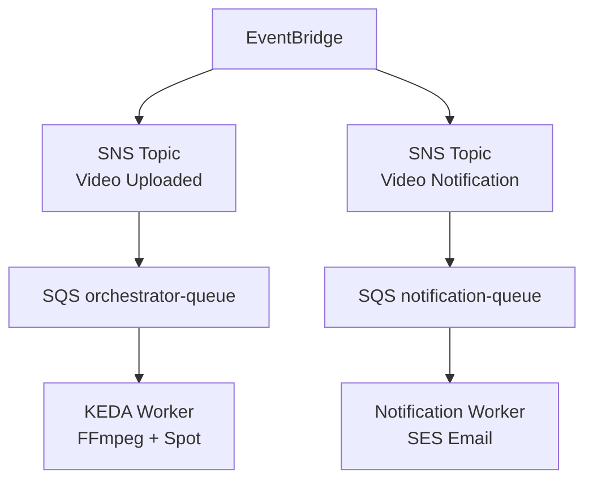

# ADR 008 — Arquitetura Híbrida: KEDA Workers + Lambda

| Campo      | Valor                |
|------------|----------------------|
| Status     | Aceito (Revisado — ver ADR 014) |
| Data       | 2026-01-17           |
| Autor      | Arão Freitas         |

## Contexto

O sistema tem dois tipos distintos de workloads:

1. **Processamento pesado** (Split/Print de vídeo):
   - Duração: 20s-5min por segmento
   - CPU/RAM intensivo (FFmpeg)
   - Uso de disco para arquivos temporários
   - Sem limite de tempo

2. **Notificações leves** (Email/SMS):
   - Duração: 100-500ms
   - Event-driven
   - Stateless
   - Escala automática

A pergunta central: **Lambda ou Kubernetes Workers?**

## Decisão

Adotar arquitetura simplificada com Spot Instances:

| Workload | Solução | Justificativa |
|----------|---------|---------------|
| **Split/Print** | KEDA Worker + K8s Jobs + **Spot** | Processamento longo, FFmpeg, sem limite de tempo, 85% economia |
| **Notificações** | **EventBridge → SNS → SQS → Notification Worker** | Fan-out nativo, resiliência em camadas, extensível |

### Arquitetura



> **Fan-out via SNS**: EventBridge roteia para SNS Topics que distribuem para filas SQS.
> Resiliência em camadas (EB → SNS → SQS). Extensível para novos subscribers.
> Ver ADR 014 para detalhes do padrão fan-out.

## Comparativo de Custos (10.000 vídeos/mês)

### Processamento Split/Print

| Métrica | Lambda | KEDA Worker (Spot) |
|---------|--------|---------------------|
| **Limite de tempo** | 15 min | Ilimitado |
| **RAM máximo** | 10GB | Configurável |
| **Custo/10k vídeos** | ~$833 | **~$0.50** |
| **Economia** | - | **99.9%** |

#### Cálculo Lambda (2GB RAM, 30s avg)
```
Requests: 10.000 × 100 partes = 1M requests
Duration: 1M × 30s × 2GB = 60M GB-s
Custo: (1M × $0.20/M) + (60M × $0.0000166667) = $0.20 + $1000 ≈ $1000

Nota: FFmpeg requer 2-4GB RAM para processamento de vídeo.
      256MB é insuficiente para workloads reais.
```

#### Cálculo KEDA + Spot Instance (c6a.large, 20s/job)
```
Jobs: 10.000 segmentos
Tempo: 10.000 × 20s = 55.5h
Custo On-Demand: 55.5h × $0.068/h = $3.78
Custo Spot (85% desconto): 55.5h × $0.010/h ≈ $0.56

Nota: Spot Instances oferecem 70-90% de desconto.
      Jobs são idempotentes — interrupção = reprocessa via SQS.
```

### Notificações Email

| Métrica | Lambda + SES | SNS → SQS → Notification Worker |
|---------|--------------|----------------------------------|
| **Custo/10k notificações** | $0.51 | **~$0.33** |
| **Compute** | Lambda ARM | Notification Worker (leve) |
| **Infra** | Lambda + SNS + SES | EventBridge + SNS + SQS + SES |
| **Fan-out** | Limitado | **Nativo (SNS)** |
| **Resiliência** | Média | **Alta (3 camadas de retry)** |
| **Extensibilidade** | Baixa | **Alta (novos subscribers)** |

#### Cálculo SNS → SQS → SES
```
Emails: 30.000 (3 emails/vídeo: quase lá, concluído, ou falha)
Custo SES: 30k × $0.0001 = $0.30
EventBridge: 30k eventos × $1/M = $0.03
SNS: 30k publicações = Grátis (free tier 1M/mês)
SNS → SQS delivery: Grátis
SQS: 30k mensagens = $0.01

Total: ~$0.34/mês

Nota: Fan-out nativo. Retry em camadas. Extensível.
```

#### Templates Utilizados
- **VideoQuaseFinalizado**: Enviado quando status = SPLITTING
- **VideoConcluido**: Enviado quando status = COMPLETED
- **VideoFalhou**: Enviado quando status = FAILED

## Consequências

### Positivas

- **Custo mínimo**: ~$1/mês vs ~$1000/mês (99% economia)
- **Fan-out nativo**: SNS distribui eventos para múltiplos consumers
- **Performance adequada**: Cada workload com runtime ideal
- **Escalabilidade**: KEDA escala baseado em SQS, SNS/SES escalam automaticamente
- **Resiliência**: 3 camadas de retry (EventBridge → SNS → SQS) + DLQ
- **Spot-friendly**: Interrupções não causam perda de dados
- **Infra simplificada**: Menos serviços para manter

### Negativas

- Monitoramento em dois lugares (CloudWatch + Prometheus/Grafana)
- Deploy K8s mais complexo que serverless puro
- Scale 0→1 pod leva 5-30s (aceitável para jobs de 20s+)
- Notification Worker necessário para consumir da fila e enviar emails via SES

## Configuração KEDA + Spot

### ScaledObject
```yaml
apiVersion: keda.sh/v1alpha1
kind: ScaledObject
metadata:
  name: split-worker
spec:
  scaleTargetRef:
    name: split-worker
  minReplicaCount: 0  # Scale to zero quando idle
  maxReplicaCount: 10
  cooldownPeriod: 300  # 5min antes de scale down
  triggers:
    - type: aws-sqs-queue
      metadata:
        queueURL: https://sqs.us-east-1.amazonaws.com/123456789/split-queue
        queueLength: "5"
        awsRegion: us-east-1
```

### Node Group Spot (EKS)
```yaml
apiVersion: eksctl.io/v1alpha5
kind: ClusterConfig
metadata:
  name: fiapx-cluster
  region: us-east-1
managedNodeGroups:
  - name: spot-workers
    instanceTypes: [c6a.large, c5a.large, c5.large]  # Diversificação
    spot: true
    minSize: 0
    maxSize: 10
    labels:
      workload: video-processing
    taints:
      - key: spot
        value: "true"
        effect: NoSchedule
```

### Tolerations no Worker
```yaml
tolerations:
  - key: spot
    operator: Equal
    value: "true"
    effect: NoSchedule
nodeSelector:
  workload: video-processing
```

> **Nota sobre Spot**: Interrupções são mitigadas por:
> - Jobs idempotentes (reprocessa o mesmo segmento)
> - SQS visibility timeout (mensagem volta para fila)
> - Diversificação de instance types (reduz chance de interrupção)

## Configuração EventBridge → SNS → SQS (Fan-out)

### EventBridge Rule + SNS Target
```yaml
NotificationRule:
  Type: AWS::Events::Rule
  Properties:
    EventPattern:
      source: ["fiapx.video"]
      detail-type: ["Video Status Changed"]
      detail:
        status: ["PROCESSING", "COMPLETED", "FAILED"]
    Targets:
      - Id: video-notification-sns-target
        Arn: !Ref VideoNotificationTopic

VideoNotificationTopic:
  Type: AWS::SNS::Topic
  Properties:
    TopicName: video-notification-topic

NotificationQueueSubscription:
  Type: AWS::SNS::Subscription
  Properties:
    TopicArn: !Ref VideoNotificationTopic
    Protocol: sqs
    Endpoint: !GetAtt NotificationQueue.Arn
    RawMessageDelivery: true
```

> **Nota**: Ver ADR 014 para justificativa completa do padrão EventBridge → SNS → SQS.

## Alternativas Consideradas

1. **Lambda para tudo**: Descartado por limite de 15min e custo ~1000x maior para processamento pesado
2. **Lambda para notificações**: Funciona, mas overkill para templates simples
3. **KEDA para tudo**: Descartado por overhead de pods para workloads curtos
4. **ECS Fargate**: Descartado por custo maior que KEDA e menos flexibilidade
5. **On-Demand em vez de Spot**: Funciona, mas 10x mais caro sem benefício
6. **Pinpoint**: Mais features (segmentação, métricas), mas mais caro e complexo

## Otimizações Futuras

| Otimização | Economia | Quando Considerar |
|------------|----------|-------------------|
| **Graviton (ARM)** | +20-40% | Se FFmpeg build suportar ARM |
| **GPU Spot (g4dn)** | Variável | Vídeos longos, H.265/AV1, alto volume |
| **Karpenter** | Ops overhead | Substituir Cluster Autoscaler |

## Referências

- [AWS Lambda Pricing](https://aws.amazon.com/lambda/pricing/)
- [EC2 Spot Instances](https://aws.amazon.com/ec2/spot/)
- [EC2 Spot Best Practices](https://docs.aws.amazon.com/AWSEC2/latest/UserGuide/spot-best-practices.html)
- [SES Email Templates](https://docs.aws.amazon.com/ses/latest/dg/send-personalized-email-api.html)
- [SNS Fan-out to SQS](https://docs.aws.amazon.com/sns/latest/dg/sns-sqs-as-subscriber.html)
- [FinOps: Containers vs Serverless](https://aws.amazon.com/blogs/aws-cloud-financial-management/a-finops-guide-to-comparing-containers-and-serverless-functions-for-compute/)
- [KEDA SQS Scaler](https://keda.sh/docs/2.12/scalers/aws-sqs/)
- [AWS Well-Architected: Cost Optimization](https://docs.aws.amazon.com/wellarchitected/latest/cost-optimization-pillar/welcome.html)
