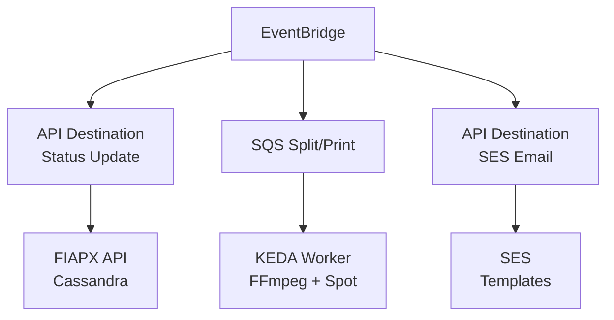

# ADR 008 — Arquitetura Híbrida: KEDA Workers + Lambda

| Campo      | Valor                |
|------------|----------------------|
| Status     | Aceito               |
| Data       | 2026-01-17           |
| Autor      | Arão Freitas         |

## Contexto

O sistema tem dois tipos distintos de workloads:

1. **Processamento pesado** (Split/Print de vídeo):
   - Duração: 20s-5min por segmento
   - CPU/RAM intensivo (FFmpeg)
   - Uso de disco para arquivos temporários
   - Sem limite de tempo

2. **Notificações leves** (Email/SMS):
   - Duração: 100-500ms
   - Event-driven
   - Stateless
   - Escala automática

A pergunta central: **Lambda ou Kubernetes Workers?**

## Decisão

Adotar arquitetura simplificada com Spot Instances:

| Workload | Solução | Justificativa |
|----------|---------|---------------|
| **Split/Print** | KEDA Worker + K8s Jobs + **Spot** | Processamento longo, FFmpeg, sem limite de tempo, 85% economia |
| **Notificações** | **SES Templates + API Destination** | Zero compute, só SES, máxima simplicidade |

### Arquitetura



> **Sem Lambda**: Notificações via SES Templates + API Destination.
> Zero compute. Só paga pelo envio de email ($0.10/1000).

## Comparativo de Custos (10.000 vídeos/mês)

### Processamento Split/Print

| Métrica | Lambda | KEDA Worker (Spot) |
|---------|--------|---------------------|
| **Limite de tempo** | 15 min | Ilimitado |
| **RAM máximo** | 10GB | Configurável |
| **Custo/10k vídeos** | ~$833 | **~$0.50** |
| **Economia** | - | **99.9%** |

#### Cálculo Lambda (2GB RAM, 30s avg)
```
Requests: 10.000 × 100 partes = 1M requests
Duration: 1M × 30s × 2GB = 60M GB-s
Custo: (1M × $0.20/M) + (60M × $0.0000166667) = $0.20 + $1000 ≈ $1000

Nota: FFmpeg requer 2-4GB RAM para processamento de vídeo.
      256MB é insuficiente para workloads reais.
```

#### Cálculo KEDA + Spot Instance (c6a.large, 20s/job)
```
Jobs: 10.000 segmentos
Tempo: 10.000 × 20s = 55.5h
Custo On-Demand: 55.5h × $0.068/h = $3.78
Custo Spot (85% desconto): 55.5h × $0.010/h ≈ $0.56

Nota: Spot Instances oferecem 70-90% de desconto.
      Jobs são idempotentes — interrupção = reprocessa via SQS.
```

### Notificações Email

| Métrica | Lambda + SES | SES Templates + API Dest |
|---------|--------------|--------------------------|
| **Custo/10k notificações** | $0.51 | **$0.10** |
| **Compute** | Lambda ARM | **Zero** |
| **Infra** | Lambda + SNS + SES | Só EventBridge + SES |
| **Flexibilidade** | Alta | Média |
| **Economia** | - | **80%** |

#### Cálculo SES Templates (sem Lambda)
```
Emails: 30.000 (3 emails/vídeo: quase lá, concluído, ou falha)
Custo SES: 30k × $0.0001 = $0.30
EventBridge: 30k eventos × $1/M = $0.03
API Destination: Grátis (primeiros 5M/mês)

Total: ~$0.33/mês

Nota: Zero compute. Zero Lambda. Zero cold start.
```

#### Templates Utilizados
- **VideoQuaseFinalizado**: Enviado quando status = SPLITTING
- **VideoConcluido**: Enviado quando status = COMPLETED
- **VideoFalhou**: Enviado quando status = FAILED

## Consequências

### Positivas

- **Custo mínimo**: ~$1/mês vs ~$1000/mês (99% economia)
- **Zero Lambda**: Notificações sem compute, só SES Templates
- **Performance adequada**: Cada workload com runtime ideal
- **Escalabilidade**: KEDA escala baseado em SQS, SES escala automaticamente
- **Resiliência**: Jobs idempotentes + SQS visibility timeout = retry automático
- **Spot-friendly**: Interrupções não causam perda de dados
- **Infra simplificada**: Menos serviços para manter

### Negativas

- Monitoramento em dois lugares (CloudWatch + Prometheus/Grafana)
- Deploy K8s mais complexo que serverless puro
- Scale 0→1 pod leva 5-30s (aceitável para jobs de 20s+)
- Templates SES limitados (sem lógica condicional complexa)

## Configuração KEDA + Spot

### ScaledObject
```yaml
apiVersion: keda.sh/v1alpha1
kind: ScaledObject
metadata:
  name: split-worker
spec:
  scaleTargetRef:
    name: split-worker
  minReplicaCount: 0  # Scale to zero quando idle
  maxReplicaCount: 10
  cooldownPeriod: 300  # 5min antes de scale down
  triggers:
    - type: aws-sqs-queue
      metadata:
        queueURL: https://sqs.us-east-1.amazonaws.com/123456789/split-queue
        queueLength: "5"
        awsRegion: us-east-1
```

### Node Group Spot (EKS)
```yaml
apiVersion: eksctl.io/v1alpha5
kind: ClusterConfig
metadata:
  name: fiapx-cluster
  region: us-east-1
managedNodeGroups:
  - name: spot-workers
    instanceTypes: [c6a.large, c5a.large, c5.large]  # Diversificação
    spot: true
    minSize: 0
    maxSize: 10
    labels:
      workload: video-processing
    taints:
      - key: spot
        value: "true"
        effect: NoSchedule
```

### Tolerations no Worker
```yaml
tolerations:
  - key: spot
    operator: Equal
    value: "true"
    effect: NoSchedule
nodeSelector:
  workload: video-processing
```

> **Nota sobre Spot**: Interrupções são mitigadas por:
> - Jobs idempotentes (reprocessa o mesmo segmento)
> - SQS visibility timeout (mensagem volta para fila)
> - Diversificação de instance types (reduz chance de interrupção)

## Configuração SES Templates + API Destination

### Template SES (CloudFormation)
```yaml
VideoQuaseFinalizadoTemplate:
  Type: AWS::SES::Template
  Properties:
    Template:
      TemplateName: VideoQuaseFinalizado
      SubjectPart: "Seu vídeo está quase pronto! 🎬"
      HtmlPart: |
        <h1>Olá {{name}},</h1>
        <p>Seu vídeo <strong>"{{videoName}}"</strong> está quase pronto!</p>
        <p>Estamos finalizando o processamento. Você receberá outro email quando estiver disponível.</p>
        <p>Status: Gerando imagens (~80%)</p>

VideoConcluidoTemplate:
  Type: AWS::SES::Template
  Properties:
    Template:
      TemplateName: VideoConcluido
      SubjectPart: "Seu vídeo está pronto! ✅"
      HtmlPart: |
        <h1>Olá {{name}},</h1>
        <p>Seu vídeo <strong>"{{videoName}}"</strong> foi processado com sucesso!</p>
        <p><a href="{{downloadUrl}}">Clique aqui para download</a></p>
        <p>O link expira em 7 dias.</p>
```

### EventBridge Rule + API Destination
```yaml
NotificationRule:
  Type: AWS::Events::Rule
  Properties:
    EventPattern:
      source: ["fiapx.video"]
      detail-type: ["Video Status Changed"]
      detail:
        status: ["SPLITTING", "COMPLETED", "FAILED"]
    Targets:
      - Id: ses-api-destination
        Arn: !GetAtt SESApiDestination.Arn
        RoleArn: !GetAtt EventBridgeRole.Arn
        InputTransformer:
          InputPathsMap:
            email: "$.detail.userEmail"
            name: "$.detail.userName"
            videoName: "$.detail.videoName"
            status: "$.detail.status"
            downloadUrl: "$.detail.downloadUrl"
          InputTemplate: |
            {
              "Destination": {"ToAddresses": ["<email>"]},
              "Content": {
                "Template": {
                  "TemplateName": "<status>",
                  "TemplateData": "{\"name\":\"<name>\",\"videoName\":\"<videoName>\",\"downloadUrl\":\"<downloadUrl>\"}"
                }
              }
            }

SESApiDestination:
  Type: AWS::Events::ApiDestination
  Properties:
    ConnectionArn: !GetAtt SESConnection.Arn
    HttpMethod: POST
    InvocationEndpoint: https://email.us-east-1.amazonaws.com/v2/email/outbound-emails
    InvocationRateLimitPerSecond: 10
```

## Alternativas Consideradas

1. **Lambda para tudo**: Descartado por limite de 15min e custo ~1000x maior para processamento pesado
2. **Lambda para notificações**: Funciona, mas overkill para templates simples
3. **KEDA para tudo**: Descartado por overhead de pods para workloads curtos
4. **ECS Fargate**: Descartado por custo maior que KEDA e menos flexibilidade
5. **On-Demand em vez de Spot**: Funciona, mas 10x mais caro sem benefício
6. **Pinpoint**: Mais features (segmentação, métricas), mas mais caro e complexo

## Otimizações Futuras

| Otimização | Economia | Quando Considerar |
|------------|----------|-------------------|
| **Graviton (ARM)** | +20-40% | Se FFmpeg build suportar ARM |
| **GPU Spot (g4dn)** | Variável | Vídeos longos, H.265/AV1, alto volume |
| **Karpenter** | Ops overhead | Substituir Cluster Autoscaler |

## Referências

- [AWS Lambda Pricing](https://aws.amazon.com/lambda/pricing/)
- [EC2 Spot Instances](https://aws.amazon.com/ec2/spot/)
- [EC2 Spot Best Practices](https://docs.aws.amazon.com/AWSEC2/latest/UserGuide/spot-best-practices.html)
- [SES Email Templates](https://docs.aws.amazon.com/ses/latest/dg/send-personalized-email-api.html)
- [EventBridge API Destinations](https://docs.aws.amazon.com/eventbridge/latest/userguide/eb-api-destinations.html)
- [FinOps: Containers vs Serverless](https://aws.amazon.com/blogs/aws-cloud-financial-management/a-finops-guide-to-comparing-containers-and-serverless-functions-for-compute/)
- [KEDA SQS Scaler](https://keda.sh/docs/2.12/scalers/aws-sqs/)
- [AWS Well-Architected: Cost Optimization](https://docs.aws.amazon.com/wellarchitected/latest/cost-optimization-pillar/welcome.html)
