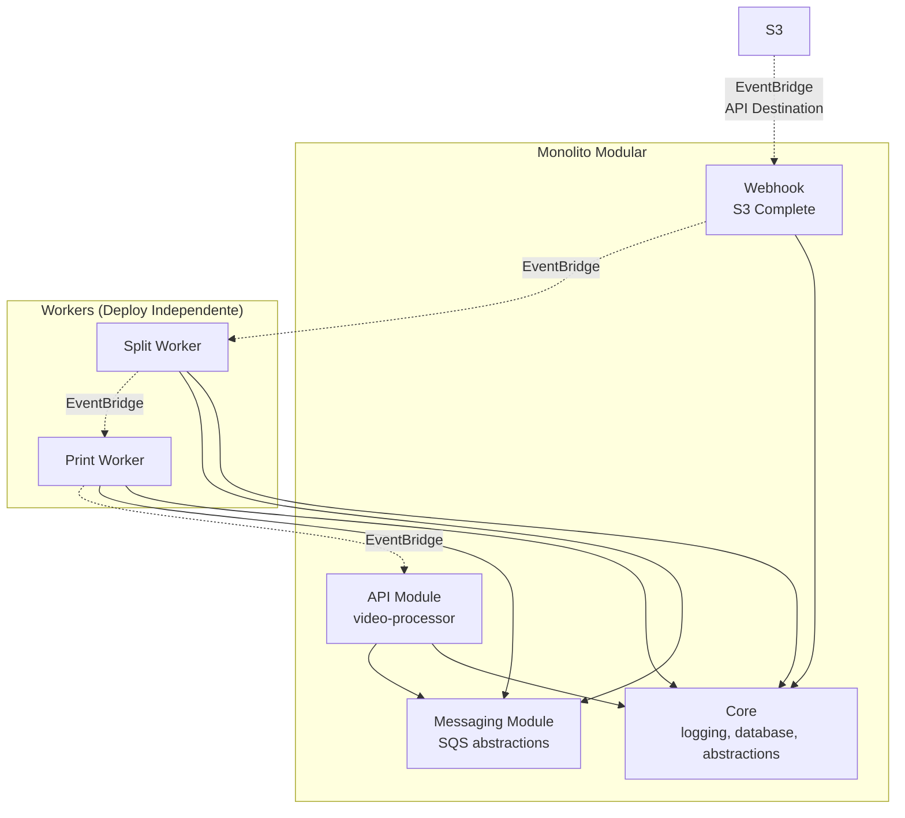

# ADR 009 — Monolito Modular com Workers Distribuídos

| Campo      | Valor                |
|------------|----------------------|
| Status     | Aceito               |
| Data       | 2026-01-18           |
| Autor      | Arão Freitas         |

## Contexto

O sistema FIAPX processa vídeos em múltiplas etapas (upload, split, print) com diferentes características de runtime:

| Componente | Característica | Requisito |
|------------|----------------|-----------|
| **API** | Request/Response | Baixa latência, alta disponibilidade |
| **Split Worker** | CPU-intensivo | FFmpeg, arquivos temporários, longa duração |
| **Print Worker** | CPU-intensivo | FFmpeg, extração de frames, longa duração |

A pergunta central: **Como organizar o código para balancear simplicidade de desenvolvimento com flexibilidade de deploy?**

### Contexto de Startup

Em uma startup early-stage, prioridades são:
1. **Velocidade de desenvolvimento**: Time pequeno, iterações rápidas
2. **Custo operacional baixo**: Sem budget para infra complexa
3. **Evolução incremental**: Arquitetura que cresce junto com o produto

Microserviços completos seriam prematuros:
- Overhead de múltiplos repositórios
- Sincronização de contratos entre times (que não existem ainda)
- Infra de observabilidade distribuída desde o dia 1
- Deploys coordenados para mudanças cross-cutting

## Decisão

Adotar **Monolito Modular com Workers Deployáveis Independentemente**:

```
fiap-image/                              # Monorepo único
├── src/
│   ├── core/                            # Código compartilhado
│   │   ├── libs/logging/
│   │   ├── libs/database/
│   │   └── abstractions/messaging/
│   ├── modules/
│   │   ├── video-processor/             # Módulo da API
│   │   │   └── presentation/routes/
│   │   │       └── webhook-s3-complete  # Webhook para eventos S3
│   │   └── messaging/sqs/               # Abstração SQS reutilizável
│   └── index.ts                         # Entrypoint da API
├── workers/
│   └── src/
│       ├── split-worker.ts              # Worker de segmentação
│       ├── print-worker.ts              # Worker de extração
│       └── ffmpeg.service.ts            # Serviço compartilhado
├── Dockerfile.api                       # Build da API (produção)
├── Dockerfile.api.dev                   # Build da API (desenvolvimento)
├── Dockerfile.workers                   # Build dos Workers
├── Dockerfile.api.dockerignore          # Ignore específico da API
├── Dockerfile.workers.dockerignore      # Ignore específico dos Workers
└── package.json                         # Dependências compartilhadas
```

> **Nota**: Ver ADR 010 para detalhes sobre o fluxo de eventos via webhook.

### Características da Arquitetura

| Aspecto | Implementação |
|---------|---------------|
| **Codebase** | Único (monorepo) |
| **Módulos** | Boundaries claros via pastas |
| **Comunicação** | Event-driven (SQS + EventBridge) |
| **Deploy** | Independente (Dockerfiles separados) |
| **Compartilhamento** | Core libs importadas diretamente |

### Boundaries de Módulo



### Fluxo de Eventos

```
S3 CompleteMultipartUpload
       ↓
   EventBridge (API Destination)
       ↓
   API Webhook (atualiza DB, emite UPLOADED)
       ↓
   EventBridge → split-queue → split-worker
       ↓
   EventBridge → print-queue → print-worker
       ↓
   EventBridge → notificações (SES)
```

> **Detalhes**: Ver ADR 010 para justificativa da escolha de webhook vs worker intermediário.

### Regras de Dependência

```
workers/
├── PODE importar de:
│   ├── src/core/libs/logging/
│   ├── src/core/abstractions/messaging/
│   └── src/modules/messaging/sqs/
│
└── NÃO PODE importar de:
    ├── src/modules/video-processor/  (domínio da API)
    ├── src/modules/docs/             (específico da API)
    └── src/index.ts                  (entrypoint da API)
```

## Caminho para Microserviços

A arquitetura atual facilita uma migração futura para microserviços:

### Passo 1: Hoje (Monolito Modular)
```
Repo: fiap-image
├── API (Dockerfile)
└── Workers (Dockerfile)
    └── Importam de src/core/ e src/modules/messaging/
```

### Passo 2: Extração (Se necessário)
```
Repo: fiap-image
├── API (Dockerfile)
└── packages/
    └── @fiapx/core (publicado no npm privado)
        ├── libs/logging/
        └── abstractions/messaging/

Repo: fiap-workers (novo)
├── split-worker/
├── print-worker/
└── package.json
    └── "@fiapx/core": "^1.0.0"
```

### O que muda na extração?

| Aspecto | Monolito Modular | Microserviços |
|---------|------------------|---------------|
| **Imports** | `../../src/core/` | `@fiapx/core` |
| **Versionamento** | Implícito (mesmo commit) | Explícito (semver) |
| **Breaking changes** | CI falha imediatamente | Contrato versionado |
| **Deploy** | Já independente | Já independente |

**Esforço estimado de migração: 2-4 horas**

1. Criar package `@fiapx/core` com código de `src/core/`
2. Publicar no npm privado (GitHub Packages, Verdaccio, etc)
3. Atualizar imports nos workers
4. Mover workers para novo repositório

A comunicação via mensageria (SQS/EventBridge) já é **contrato assíncrono** — não há acoplamento de chamadas síncronas para quebrar.

## Consequências

### Positivas

- **Desenvolvimento rápido**: Um repositório, um `bun install`, refatoração fácil
- **Deploy flexível**: Workers escalam independente da API
- **Código DRY**: `AbstractSQSConsumer` reutilizado sem duplicação
- **Type safety**: Workers importam tipos diretamente, sem geração de código
- **Migração simples**: Comunicação já é event-driven, extração é só reorganização
- **Custo zero de coordenação**: Time único, sem overhead de múltiplos repos

### Negativas

- **Acoplamento de build**: Mudança no core requer rebuild de todos os Dockerfiles
- **Tentação de violar boundaries**: Nada impede import errado (mitigado por code review)
- **Monorepo tooling**: Pode precisar de Turborepo/Nx se crescer muito

## Alternativas Consideradas

### 1. Microserviços desde o início
**Descartado**: Overhead prematuro para startup early-stage. Múltiplos repos, contratos, versionamento — complexidade sem benefício imediato.

### 2. Monolito puro (workers no mesmo processo)
**Descartado**: FFmpeg é CPU-intensivo e bloqueante. Workers no mesmo processo da API causariam:
- Latência nas rotas HTTP durante processamento
- Impossibilidade de escalar workers independentemente
- Crash do worker derrubaria a API

### 3. Workers como Lambda Functions
**Descartado**: Limite de 15 minutos do Lambda é restritivo para vídeos longos. Ver ADR 008 para análise detalhada de custos.

### 4. Copiar código core para workers (duplicação)
**Descartado**: Violação de DRY. Bugs corrigidos no core não propagariam automaticamente. Drift inevitável.

## Referências

- [Modular Monolith: A Primer](https://www.kamilgrzybek.com/blog/posts/modular-monolith-primer)
- [MonolithFirst - Martin Fowler](https://martinfowler.com/bliki/MonolithFirst.html)
- [Modular Monolith with DDD](https://github.com/kgrzybek/modular-monolith-with-ddd)
- [When to Break Up a Monolith](https://blog.pragmaticengineer.com/when-to-break-up-a-monolith/)
- [Spotify: Monorepo vs Polyrepo](https://engineering.atspotify.com/2021/06/monorepo/)
