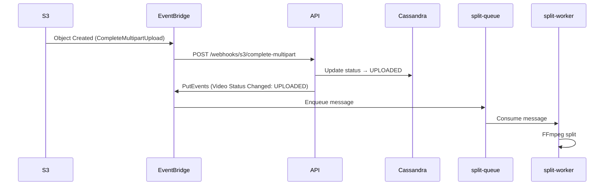

# ADR 010 — Fluxo de Eventos: API Webhook vs Worker Intermediário

| Campo      | Valor                |
|------------|----------------------|
| Status     | Aceito               |
| Data       | 2026-01-18           |
| Autor      | Arão Freitas         |

## Contexto

Quando um upload multipart é finalizado no S3, precisamos:
1. Atualizar o status do vídeo no banco de dados (UPLOADING → UPLOADED)
2. Iniciar o processamento com FFmpeg (split-worker)

A pergunta central: **Quem é responsável por fazer a ponte entre o evento do S3 e o início do processamento?**

### Opções Consideradas

| Opção | Descrição |
|-------|-----------|
| **Worker Intermediário** | Consumer SQS dedicado que atualiza DB e emite evento |
| **API Webhook** | EventBridge API Destination chama endpoint da API |
| **Split Worker faz tudo** | Worker atualiza DB + processa FFmpeg |

## Decisão

Adotar **API Webhook via EventBridge API Destination**.

### Fluxo Implementado



### Arquitetura

```
┌─────────────────────────────────────────────────────────────────────┐
│                                                                     │
│  S3 CompleteMultipartUpload                                         │
│         │                                                           │
│         ▼                                                           │
│  ┌─────────────────────┐                                            │
│  │    EventBridge      │                                            │
│  │  (multipart-rule)   │                                            │
│  └──────────┬──────────┘                                            │
│             │                                                       │
│             ▼                                                       │
│  ┌─────────────────────────────────────────────┐                    │
│  │         API Destination (Webhook)           │                    │
│  │  POST /videos/webhooks/s3/complete-multipart│                    │
│  │                                             │                    │
│  │  1. Busca vídeo no DB                       │                    │
│  │  2. Reconcilia partes como uploaded         │                    │
│  │  3. Atualiza status → UPLOADED              │                    │
│  │  4. Emite evento "Video Status Changed"     │                    │
│  └──────────┬──────────────────────────────────┘                    │
│             │                                                       │
│             ▼                                                       │
│  ┌─────────────────────┐                                            │
│  │    EventBridge      │                                            │
│  │ (video-uploaded)    │                                            │
│  └──────────┬──────────┘                                            │
│             │                                                       │
│             ▼                                                       │
│  ┌─────────────────────┐     ┌─────────────────────┐                │
│  │    split-queue      │────▶│   split-worker      │                │
│  └─────────────────────┘     │   (FFmpeg split)    │                │
│                              └──────────┬──────────┘                │
│                                         │                           │
│                                         ▼                           │
│                              ┌─────────────────────┐                │
│                              │ EventBridge         │                │
│                              │ (video-splitting)   │                │
│                              └──────────┬──────────┘                │
│                                         │                           │
│                                         ▼                           │
│                              ┌─────────────────────┐                │
│                              │   print-queue       │                │
│                              └──────────┬──────────┘                │
│                                         │                           │
│                                         ▼                           │
│                              ┌─────────────────────┐                │
│                              │   print-worker      │                │
│                              │   (FFmpeg frames)   │                │
│                              └─────────────────────┘                │
│                                                                     │
└─────────────────────────────────────────────────────────────────────┘
```

### Endpoint Implementado

```typescript
// POST /videos/webhooks/s3/complete-multipart
// Body: { bucket: string, key: string }

export const webhookS3CompleteRoute = BaseElysia.create().post(
  '/webhooks/s3/complete-multipart',
  async ({ body }) => {
    const { bucket, key } = body
    const videoId = key.split('/')[0]

    // 1. Buscar vídeo
    const video = await videoRepository.findById(videoId)

    // 2. Reconciliar partes e atualizar status
    video.reconcileAllPartsAsUploaded()
    video.completeUpload() // UPLOADING → UPLOADED

    // 3. Persistir no banco
    await videoRepository.updateVideo(video)

    // 4. Emitir evento para acionar workers
    await eventBridge.putEvents({
      Source: 'fiapx.video',
      DetailType: 'Video Status Changed',
      Detail: { videoId, status: 'UPLOADED', ... }
    })

    return { status: 'UPLOADED' }
  }
)
```

## Justificativa

### Por que Webhook e não Worker Intermediário?

| Critério | Worker Intermediário | API Webhook |
|----------|---------------------|-------------|
| **Componentes** | API + Worker + SQS | Apenas API |
| **Latência** | SQS polling (até 20s) | HTTP síncrono (~100ms) |
| **Infraestrutura** | Container adicional | Reutiliza API existente |
| **Observabilidade** | Logs em 2 lugares | Logs centralizados na API |
| **Retry** | SQS built-in | EventBridge retry policy |
| **Custo** | Container 24/7 | Zero (usa API existente) |

### Por que não Split Worker faz tudo?

Misturaria responsabilidades:
- Worker teria que entender de banco de dados
- Worker precisaria de dependências do domínio (entities, repositories)
- Acoplamento entre lógica de negócio e processamento FFmpeg

Com webhook, mantemos **separação de responsabilidades**:
- **API**: Lógica de negócio, persistência, coordenação
- **Workers**: Apenas processamento FFmpeg

## Consequências

### Positivas

- **Menos infraestrutura**: Elimina container/worker intermediário
- **Menor latência**: HTTP síncrono vs polling SQS
- **Código centralizado**: Lógica de transição de status na API
- **Observabilidade simples**: Todos os logs de negócio na API
- **Retry automático**: EventBridge tem retry policy configurável
- **Idempotência**: Webhook verifica status antes de processar

### Negativas

- **Dependência da API**: Se API estiver fora, eventos ficam pendentes (mitigado por retry do EventBridge)
- **Timeout**: Webhook precisa responder rápido (EventBridge timeout: 5s default)
- **LocalStack**: API Destinations têm suporte limitado no LocalStack Community

## Configuração EventBridge

### Connection

```yaml
aws events create-connection \
  --name fiapx-api-connection \
  --authorization-type API_KEY \
  --auth-parameters '{
    "ApiKeyAuthParameters": {
      "ApiKeyName": "x-api-key",
      "ApiKeyValue": "..."
    }
  }'
```

### API Destination

```yaml
aws events create-api-destination \
  --name fiapx-s3-complete-webhook \
  --connection-arn arn:aws:events:...:connection/fiapx-api-connection \
  --invocation-endpoint https://api.fiapx.com/videos/webhooks/s3/complete-multipart \
  --http-method POST \
  --invocation-rate-limit-per-second 10
```

### Rule Target

```yaml
aws events put-targets \
  --rule multipart-complete-rule \
  --targets '[{
    "Id": "api-webhook-target",
    "Arn": "arn:aws:events:...:api-destination/fiapx-s3-complete-webhook",
    "InputTransformer": {
      "InputPathsMap": {
        "bucket": "$.detail.bucket.name",
        "key": "$.detail.object.key"
      },
      "InputTemplate": "{\"bucket\": <bucket>, \"key\": <key>}"
    }
  }]'
```

## Teste Local

Como LocalStack Community tem suporte limitado a API Destinations, para testar localmente:

```bash
# Simular o webhook diretamente
curl -X POST http://localhost:3002/videos/webhooks/s3/complete-multipart \
  -H "Content-Type: application/json" \
  -d '{"bucket": "fiapx-video-parts", "key": "VIDEO-PATH/video.mp4"}'
```

## Alternativas Descartadas

### 1. Worker Intermediário (complete-multipart-worker)

**Descartado**: Adiciona complexidade sem benefício. Container adicional, código duplicado, latência de polling.

### 2. Split Worker atualiza DB

**Descartado**: Viola separação de responsabilidades. Workers devem focar em processamento, não em lógica de negócio.

### 3. Lambda como intermediário

**Descartado**: Overhead de cold start, custo adicional, mais um serviço para manter. Ver ADR 008.

### 4. SNS Fan-out (paralelo)

**Descartado**: Não garante ordem. Worker poderia começar antes do DB estar atualizado.

## Referências

- [EventBridge API Destinations](https://docs.aws.amazon.com/eventbridge/latest/userguide/eb-api-destinations.html)
- [EventBridge Retry Policy](https://docs.aws.amazon.com/eventbridge/latest/userguide/eb-rule-dlq.html)
- [Webhook vs Message Queue](https://www.svix.com/resources/faq/webhooks-vs-message-queues/)
