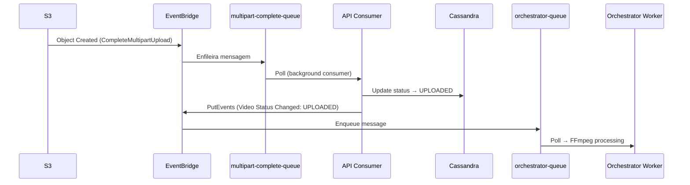

# ADR 010 — Fluxo de Eventos S3: SQS Consumer vs API Destination

| Campo      | Valor                |
|------------|----------------------|
| Status     | Aceito (Revisado)    |
| Data       | 2026-01-28           |
| Autor      | Arão Freitas         |

## Contexto

Quando um upload multipart é finalizado no S3, precisamos:
1. Atualizar o status do vídeo no banco de dados (UPLOADING → UPLOADED)
2. Iniciar o processamento com FFmpeg (orchestrator-worker)

A pergunta central: **Quem é responsável por fazer a ponte entre o evento do S3 e o início do processamento?**

### Opções Consideradas

| Opção | Descrição |
|-------|-----------|
| **SQS Consumer na API** | EventBridge → SQS → API consome a fila |
| **API Destination** | EventBridge API Destination chama endpoint HTTP |
| **Worker Intermediário** | Container separado para consumir eventos S3 |

## Decisão

Adotar **SQS Consumer integrado à API**.

### Justificativa

| Critério | API Destination | SQS Consumer |
|----------|-----------------|--------------|
| **Resiliência** | Perde eventos se API down | Mensagens preservadas na fila |
| **Dev/Prod parity** | Não funciona no LocalStack Free | Funciona igual |
| **Observabilidade** | Difícil debugar falhas | CloudWatch metrics, DLQ |
| **Retry** | EventBridge retry (limitado) | SQS retry + DLQ |
| **Consistência** | Diferente dos outros fluxos | Mesmo padrão (SQS → Consumer) |

### Fluxo Implementado



### Arquitetura

```
┌─────────────────────────────────────────────────────────────────────┐
│                                                                     │
│  S3 CompleteMultipartUpload                                         │
│         │                                                           │
│         ▼                                                           │
│  ┌─────────────────────┐                                            │
│  │    EventBridge      │                                            │
│  │  (multipart-rule)   │                                            │
│  └──────────┬──────────┘                                            │
│             │                                                       │
│             ▼                                                       │
│  ┌─────────────────────────────────────────────┐                    │
│  │       multipart-complete-queue (SQS)        │                    │
│  └──────────┬──────────────────────────────────┘                    │
│             │                                                       │
│             ▼                                                       │
│  ┌─────────────────────────────────────────────┐                    │
│  │           API (Consumer interno)            │                    │
│  │                                             │                    │
│  │  1. Busca vídeo no DB                       │                    │
│  │  2. Reconcilia partes como uploaded         │                    │
│  │  3. Atualiza status → UPLOADED              │                    │
│  │  4. Emite evento "Video Status Changed"     │                    │
│  └──────────┬──────────────────────────────────┘                    │
│             │                                                       │
│             ▼                                                       │
│  ┌─────────────────────┐                                            │
│  │    EventBridge      │                                            │
│  │ (video-uploaded)    │                                            │
│  └──────────┬──────────┘                                            │
│             │                                                       │
│             ▼                                                       │
│  ┌─────────────────────┐     ┌─────────────────────┐                │
│  │  orchestrator-queue │────▶│ orchestrator-worker │                │
│  └─────────────────────┘     │   (FFmpeg calc)     │                │
│                              └──────────┬──────────┘                │
│                                         │                           │
│                                         ▼                           │
│                              ┌─────────────────────┐                │
│                              │   print-queue       │                │
│                              └──────────┬──────────┘                │
│                                         │                           │
│                                         ▼                           │
│                              ┌─────────────────────┐                │
│                              │   print-worker      │                │
│                              │   (FFmpeg frames)   │                │
│                              └─────────────────────┘                │
│                                                                     │
└─────────────────────────────────────────────────────────────────────┘
```

### Handler Implementado

```typescript
// src/modules/video-processor/infra/consumers/complete-multipart-handler.ts
export class CompleteMultipartHandler {
  async handle(event: CompleteMultipartEvent): Promise<Result<void, Error>> {
    const { key } = event.detail.object
    const { name: bucket } = event.detail.bucket

    // 1. Parse path para extrair videoId
    const parsed = this.pathBuilder.parse(`${bucket}/${key}`)
    const { videoId } = parsed

    // 2. Buscar vídeo
    const video = await videoRepository.findById(videoId)

    // 3. Reconciliar partes e atualizar status
    video.reconcileAllPartsAsUploaded()
    video.completeUpload() // UPLOADING → UPLOADED

    // 4. Persistir no banco
    await videoRepository.updateVideo(video)

    // 5. Emitir evento para acionar orchestrator
    await eventBridgeClient.send(
      new PutEventsCommand({
        Entries: [{
          Source: 'fiapx.video',
          DetailType: 'Video Status Changed',
          Detail: JSON.stringify({
            videoId,
            videoPath: video.thirdPartyVideoIntegration?.key,
            status: 'UPLOADED',
          }),
        }],
      }),
    )
  }
}
```

### Consumer Integrado à API

```typescript
// src/modules/video-processor/infra/consumers/complete-multipart.consumer.ts
export class CompleteMultipartConsumer extends AbstractSQSConsumer<CompleteMultipartEvent> {
  constructor(logger, handler) {
    super({ queueUrl: process.env.COMPLETE_MULTIPART_QUEUE_URL }, logger)
  }

  protected async handleMessage(event: CompleteMultipartEvent): Promise<void> {
    await this.completeMultipartHandler.handle(event)
  }
}

// src/index.ts - Inicia junto com a API
app.listen(3010, () => {
  startConsumers() // Inicia polling da fila
})
```

## Justificativa Detalhada

### Por que SQS e não API Destination?

1. **API Destinations não funcionam no LocalStack Free**
   - Impossível testar localmente sem workarounds
   - Dev/prod parity é essencial para confiança no código

2. **Resiliência**
   - Com SQS: se API está down, mensagens aguardam na fila
   - Com API Destination: eventos são perdidos (EventBridge retry limitado)

3. **Consistência arquitetural**
   - Workers já usam SQS (orchestrator-queue, print-queue)
   - Mesmo padrão para todos os fluxos

4. **Observabilidade**
   - SQS: ApproximateNumberOfMessages, DLQ, CloudWatch Alarms
   - API Destination: logs dispersos, difícil correlacionar falhas

### Por que Consumer na API e não Worker separado?

| Critério | Worker Separado | API como Consumer |
|----------|-----------------|-------------------|
| **Responsabilidade** | Duplica lógica de negócio | Lógica centralizada |
| **Infraestrutura** | +1 container | Usa API existente |
| **Dependências** | Precisa VideoRepository, EventBridge | Já tem tudo |
| **Workers** | Mistura propósitos | Focados em FFmpeg |

**Princípio**: Workers devem focar em processamento pesado (FFmpeg). Lógica de negócio (DB, eventos) fica na API.

## Consequências

### Positivas

- **Dev/prod parity**: Mesmo código funciona local e em produção
- **Resiliência**: Mensagens preservadas se API temporariamente indisponível
- **Menos infraestrutura**: Sem container adicional para worker intermediário
- **Código centralizado**: Lógica de transição de status na API
- **Observabilidade**: Métricas SQS, DLQ, CloudWatch Alarms
- **Consistência**: Mesmo padrão de todos os outros fluxos

### Negativas

- **Acoplamento**: API agora também é consumer (mitigado pela separação em módulos)
- **Polling**: Consumer fica em loop (mitigado pelo long polling do SQS)

## Configuração EventBridge

### Rule

```yaml
aws events put-rule \
  --name multipart-complete-rule \
  --event-pattern '{
    "source": ["aws.s3"],
    "detail-type": ["Object Created"],
    "detail": {
      "bucket": { "name": ["fiapx-video-parts"] },
      "reason": ["CompleteMultipartUpload"]
    }
  }'
```

### Target (SQS)

```yaml
aws events put-targets \
  --rule multipart-complete-rule \
  --targets '[{
    "Id": "multipart-complete-queue-target",
    "Arn": "arn:aws:sqs:us-east-1:ACCOUNT:multipart-complete-queue"
  }]'
```

## Teste Local

```bash
# Emitir evento S3 via EventBridge
aws --endpoint-url=http://localhost:4566 events put-events \
  --entries '[
    {
      "Source": "aws.s3",
      "DetailType": "Object Created",
      "Detail": "{\"bucket\":{\"name\":\"fiapx-video-parts\"},\"object\":{\"key\":\"video/VIDEO-ID/file/video.mp4\"},\"reason\":\"CompleteMultipartUpload\"}"
    }
  ]'

# Verificar mensagem na fila
aws --endpoint-url=http://localhost:4566 sqs receive-message \
  --queue-url http://sqs.us-east-1.localhost.localstack.cloud:4566/000000000000/multipart-complete-queue
```

### Webhook (Alternativa para Testes Manuais)

O endpoint webhook ainda existe para testes manuais:

```bash
curl -X POST http://localhost:3002/videos/webhooks/s3/complete-multipart \
  -H "Content-Type: application/json" \
  -d '{"bucket": "fiapx-video-parts", "key": "video/VIDEO-ID/file/video.mp4"}'
```

## Alternativas Descartadas

### 1. API Destination

**Descartado**: Não funciona no LocalStack Free, menor resiliência, padrão inconsistente com resto da arquitetura.

### 2. Worker Intermediário (container separado)

**Descartado**: Adiciona complexidade sem benefício. Container adicional, código duplicado de lógica de negócio.

### 3. Orchestrator Worker atualiza DB

**Descartado**: Viola separação de responsabilidades. Workers devem focar em processamento FFmpeg, não em lógica de negócio.

## Referências

- [SQS Consumer Pattern](https://docs.aws.amazon.com/AWSSimpleQueueService/latest/SQSDeveloperGuide/sqs-best-practices.html)
- [EventBridge to SQS](https://docs.aws.amazon.com/eventbridge/latest/userguide/eb-targets.html#targets-sqs)
- [LocalStack Limitations](https://docs.localstack.cloud/user-guide/aws/eventbridge/)
