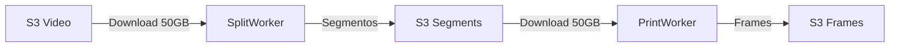
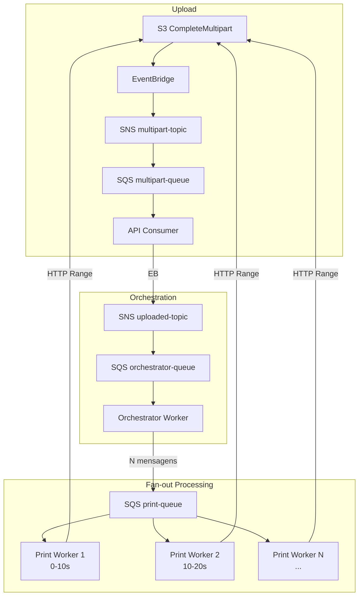

# ADR 011 — Pipeline Streaming com Fan-out para Processamento de Vídeo

| Campo      | Valor                |
|------------|----------------------|
| Status     | Aceito               |
| Data       | 2026-01-25           |
| Autor      | Arão Freitas         |

## Contexto

A arquitetura anterior apresentava um problema crítico: ao receber um vídeo via multipart upload, os workers (split e print) precisavam baixar o vídeo completo para disco antes de processar.

### Problema Identificado

```
Vídeo de 50GB:
1. Split Worker baixa 50GB para /tmp
2. FFmpeg processa e gera segmentos (~50GB adicionais)
3. Total em disco: ~100GB

Consequências:
- Containers com limite de disco falham
- Lambda (max 10GB /tmp) impossível
- ECS/Fargate precisa de ephemeral storage alto
- Custo de I/O elevado
```

### Fluxo Anterior (Problemático)



O vídeo era baixado **duas vezes**: uma pelo split worker, outra pelo print worker.

## Decisão

Adotar **Pipeline Streaming com Fan-out** onde:

1. **Orchestrator Worker** recebe evento, calcula ranges de tempo, publica N mensagens
2. **Print Workers** processam ranges via HTTP streaming (presigned URL)
3. **Consolidação** via contador atômico no banco

### Fluxo Novo



### Cálculo de Ranges

```typescript
function calculateTimeRanges(duration: number, segmentDuration = 10) {
  const totalSegments = Math.ceil(duration / segmentDuration)
  const ranges = []
  for (let i = 0; i < totalSegments; i++) {
    ranges.push({
      segmentNumber: i + 1,
      startTime: i * segmentDuration,
      endTime: Math.min((i + 1) * segmentDuration, duration),
    })
  }
  return ranges
}
```

### FFmpeg com HTTP Streaming

```bash
ffmpeg -ss 10 -to 20 -i "https://presigned-url..." -vf "fps=1" frames_%04d.jpg
```

O FFmpeg faz HTTP Range requests automaticamente, baixando apenas os bytes necessários para o range especificado.

### Mensagem para Print Worker

```typescript
type SegmentEvent = {
  detail: {
    videoId: string
    presignedUrl: string
    segmentNumber: number
    totalSegments: number
    startTime: number
    endTime: number
    userEmail?: string
    videoName?: string
  }
}
```

### Consolidação

O Print Worker atualiza o contador no banco após processar cada segmento:

```typescript
const newCount = await videoRepository.incrementProcessedSegments(videoId)
if (newCount === totalSegments) {
  await videoRepository.markAsCompleted(videoId)
  await emitEvent('Video Status Changed', { status: 'COMPLETED' })
}
```

## Justificativa

### Comparativo: Arquitetura Anterior vs Nova

| Aspecto | Anterior | Nova |
|---------|----------|------|
| Download do vídeo | Completo (2x) | Streaming por range |
| Disco necessário | 100% + segmentos | Apenas frames (~1%) |
| Paralelismo | Sequencial | N workers paralelos |
| Retry | Vídeo inteiro | Por segmento |
| Tempo (100s vídeo) | ~5 min | ~30s (10 workers) |

### Por que não Split + Print separados?

Na arquitetura anterior:
1. Split baixava vídeo, criava segmentos, uploadava
2. Print baixava segmentos, extraía frames

Problemas:
- Vídeo baixado 2x (split + print)
- Segmentos intermediários ocupam espaço
- Mais I/O de rede e disco

Na nova arquitetura:
- Vídeo lido via streaming (nunca baixado completo)
- Sem segmentos intermediários
- Cada worker processa range diretamente

## Consequências

### Positivas

- **Zero download completo**: FFmpeg lê via HTTP Range
- **Paralelismo real**: N workers processam simultaneamente
- **Retry granular**: Falha no segmento 50 só reprocessa ele
- **Menor custo**: Menos disco, menos I/O, menos tempo
- **Escala horizontal**: KEDA escala por tamanho da fila
- **Menor latência**: Pipeline em vez de sequencial

### Negativas

- **Rede durante processamento**: FFmpeg faz requests durante execução
- **Presigned URL**: Precisa gerar URL com expiração adequada
- **Coordenação**: Consolidador precisa detectar conclusão
- **Complexidade**: Mais mensagens, mais lógica de orquestração

## Alternativas Consideradas

### 1. Manter download completo com disco maior

**Descartado**: Não escala, custo alto, não resolve paralelismo.

### 2. EFS compartilhado entre workers

**Descartado**: Custo alto, latência de rede, complexidade de setup.

### 3. Split cria segmentos reais no S3

**Descartado**: Dobra o storage, mais I/O, mais latência.

### 4. Lambda com /tmp de 10GB

**Descartado**: Limite de 15 minutos, custo alto para vídeos longos.

## Referências

- [FFmpeg HTTP Input](https://ffmpeg.org/ffmpeg-protocols.html#http)
- [S3 Presigned URLs](https://docs.aws.amazon.com/AmazonS3/latest/userguide/ShareObjectPreSignedURL.html)
- [HTTP Range Requests](https://developer.mozilla.org/en-US/docs/Web/HTTP/Range_requests)
- [Fan-out Pattern](https://docs.aws.amazon.com/prescriptive-guidance/latest/modernization-integrating-microservices/fanout.html)
