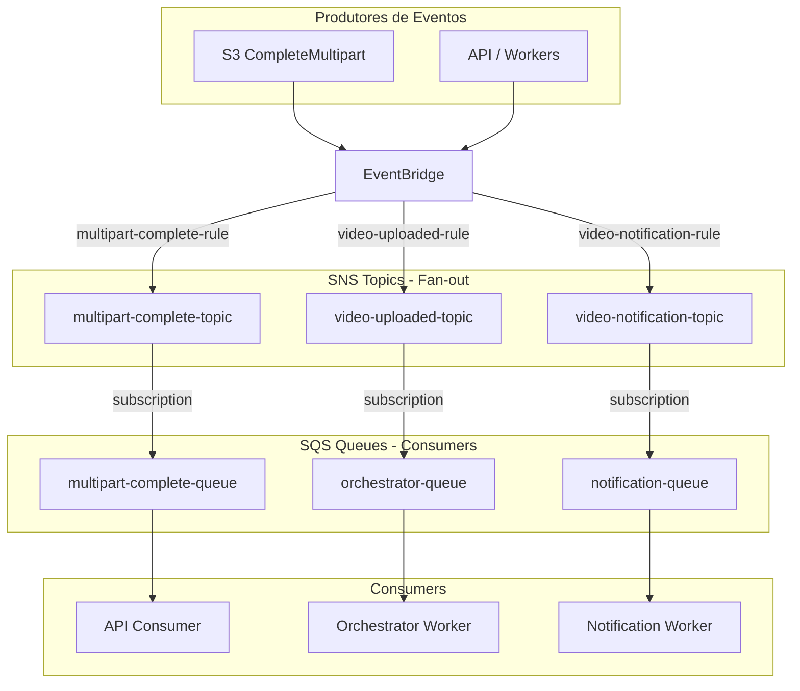

# ADR 014 — EventBridge → SNS → SQS: Fan-out Pattern para Resiliência

| Campo      | Valor                |
|------------|----------------------|
| Status     | Aceito               |
| Data       | 2026-02-08           |
| Autor      | Arão Freitas         |
| Supersede  | ADR 008 (parcial), ADR 010 (parcial) |

## Contexto

A arquitetura anterior usava EventBridge enviando eventos **diretamente** para filas SQS. Embora funcional, essa abordagem limita a capacidade de fan-out e reduz a resiliência do sistema:

- **Sem fan-out**: cada regra do EventBridge só podia enviar para uma fila SQS
- **Acoplamento**: adicionar um novo consumer exigia alterar regras do EventBridge
- **Sem replay**: mensagens perdidas não podiam ser re-entregues para novos subscribers
- **API Destinations**: notificações usavam API Destination (webhook HTTP), que não funciona no LocalStack Free e tem resiliência limitada

### Problema com API Destinations

A ADR 008 definia notificações via **EventBridge API Destination → SES**. Problemas identificados:

| Problema | Impacto |
|----------|---------|
| Não funciona no LocalStack Free | Dev/prod parity quebrado |
| Timeout de 5s para HTTP | Notificações complexas falham |
| Sem buffer | Se SES throttle, evento é perdido |
| Retry limitado | Apenas 5 tentativas no EventBridge |
| Endpoint HTTP inexistente | Rota webhook foi removida do código |

## Decisão

Inserir **Amazon SNS** como intermediário entre EventBridge e SQS em **todos** os fluxos de eventos, adotando o padrão **Fan-out** recomendado pela AWS.

### Arquitetura



### Fluxo de Eventos

```
S3 CompleteMultipartUpload
    → EventBridge (multipart-complete-rule)
    → SNS (multipart-complete-topic)
    → SQS (multipart-complete-queue)
    → API Consumer

API emite Video Status Changed (UPLOADED)
    → EventBridge (video-uploaded-rule)
    → SNS (video-uploaded-topic)
    → SQS (orchestrator-queue)
    → Orchestrator Worker

Workers emitem Video Status Changed (PROCESSING/COMPLETED/FAILED)
    → EventBridge (video-notification-rule)
    → SNS (video-notification-topic)
    → SQS (notification-queue)
    → Notification Worker → SES
```

### Raw Message Delivery

Todas as subscriptions SNS → SQS usam **Raw Message Delivery** habilitado. Isso garante que a mensagem chega na fila SQS **sem o envelope SNS**, mantendo o mesmo formato que os consumers já esperam.

```json
{
  "RawMessageDelivery": "true"
}
```

## Justificativa

### Comparativo: EventBridge → SQS vs EventBridge → SNS → SQS

| Critério | EB → SQS (antes) | EB → SNS → SQS (agora) |
|----------|-------------------|--------------------------|
| **Fan-out** | 1 target por regra | N subscribers por tópico |
| **Extensibilidade** | Alterar regra EB | Adicionar subscription |
| **Resiliência** | Retry do EB apenas | EB retry + SNS retry + SQS retry |
| **Novos consumers** | Nova regra EB + permissões | Nova subscription SNS |
| **Auditoria futura** | Requer mudanças | Adicionar subscriber de log |
| **Dev/prod parity** | Funciona | Funciona (SNS suportado no LocalStack) |
| **Latência adicional** | - | ~5-10ms (desprezível) |

### Benefícios do Fan-out

1. **Resiliência em camadas**: três camadas de retry (EventBridge → SNS → SQS)
2. **Desacoplamento total**: producers não conhecem consumers
3. **Extensibilidade zero-touch**: novos subscribers sem alterar EventBridge
4. **Padrão AWS**: recomendado pela AWS Well-Architected Framework (Serverless Lens)
5. **Futuro-proof**: facilita adicionar Lambda, HTTP endpoints, analytics

### Exemplos de extensibilidade futura

Com SNS no meio, podemos facilmente adicionar:

```
video-notification-topic
├── notification-queue (SQS) → Notification Worker → SES
├── analytics-queue (SQS) → Analytics Worker (futuro)
├── webhook-endpoint (HTTP) → Sistema externo (futuro)
└── audit-lambda (Lambda) → CloudWatch Logs (futuro)
```

Nenhuma dessas adições exige mudanças no EventBridge ou nos producers.

## Custos

### SNS Standard Topics (us-east-1)

| Recurso | Preço |
|---------|-------|
| Publicações | $0.50/milhão (primeiro 1M grátis) |
| Entregas para SQS | **Grátis** (sem custo por entrega) |
| Entregas para Lambda | **Grátis** |
| Entregas para HTTP/S | $0.60/milhão |
| Data transfer (mesma região) | **Grátis** |

### Estimativa: 10.000 vídeos/mês

| Evento | Volume | Custo SNS |
|--------|--------|-----------|
| S3 CompleteMultipart | 10k publicações | Grátis (free tier) |
| Video UPLOADED | 10k publicações | Grátis (free tier) |
| Video PROCESSING/COMPLETED/FAILED | ~30k publicações | Grátis (free tier) |
| **Total SNS** | ~50k publicações | **$0.00** |

> **Nota**: Com 50k publicações/mês, estamos dentro do free tier de 1M. Mesmo sem free tier, o custo seria $0.025/mês.

### Comparativo com arquitetura anterior

| Componente | Antes (EB→SQS + API Dest) | Agora (EB→SNS→SQS) |
|------------|----------------------------|----------------------|
| EventBridge | $0.05 | $0.05 |
| API Destination | $0.01 | $0.00 (removido) |
| SNS | $0.00 | $0.00 (free tier) |
| SQS | $0.02 | $0.02 |
| **Total** | **$0.08** | **$0.07** |

**Custo adicional do SNS: zero** (free tier cobre o volume).

## Consequências

### Positivas

- **Fan-out nativo**: um evento para múltiplos consumers sem configuração extra
- **Resiliência**: três camadas de retry (EventBridge → SNS → SQS → DLQ)
- **Extensibilidade**: novos subscribers sem tocar no EventBridge
- **Dev/prod parity**: SNS funciona no LocalStack (ao contrário de API Destinations)
- **Custo zero**: volume dentro do free tier do SNS
- **Padrão AWS**: alinhado com AWS Well-Architected Serverless Lens
- **Notificações via SQS**: notification-queue permite processing assíncrono com retry
- **Webhook removido**: endpoint HTTP inexistente eliminado da arquitetura

### Negativas

- **Latência adicional**: ~5-10ms por hop SNS (desprezível para o caso de uso)
- **Mais componentes**: 3 tópicos SNS adicionais para configurar
- **Raw Message Delivery**: necessário para manter compatibilidade com consumers existentes
- **Complexidade de IAM**: permissões SNS → SQS além das existentes

## Configuração

### SNS Topics

```bash
aws sns create-topic --name multipart-complete-topic
aws sns create-topic --name video-uploaded-topic
aws sns create-topic --name video-notification-topic
```

### Subscriptions (Raw Message Delivery)

```bash
aws sns subscribe \
  --topic-arn arn:aws:sns:us-east-1:ACCOUNT:video-uploaded-topic \
  --protocol sqs \
  --notification-endpoint arn:aws:sqs:us-east-1:ACCOUNT:orchestrator-queue \
  --attributes '{"RawMessageDelivery": "true"}'
```

### EventBridge Targets (→ SNS)

```bash
aws events put-targets \
  --rule video-uploaded-rule \
  --targets '[{
    "Id": "video-uploaded-sns-target",
    "Arn": "arn:aws:sns:us-east-1:ACCOUNT:video-uploaded-topic"
  }]'
```

### Permissões SQS (aceitar mensagens do SNS)

```json
{
  "Version": "2012-10-17",
  "Statement": [{
    "Effect": "Allow",
    "Principal": { "Service": "sns.amazonaws.com" },
    "Action": "sqs:SendMessage",
    "Resource": "arn:aws:sqs:us-east-1:ACCOUNT:orchestrator-queue",
    "Condition": {
      "ArnEquals": {
        "aws:SourceArn": "arn:aws:sns:us-east-1:ACCOUNT:video-uploaded-topic"
      }
    }
  }]
}
```

## Alternativas Consideradas

### 1. Manter EventBridge → SQS direto

**Descartado**: Sem fan-out, cada novo consumer exige nova regra no EventBridge. Menos resiliente.

### 2. EventBridge → API Destination (webhook HTTP)

**Descartado**: Não funciona no LocalStack Free, endpoint webhook foi removido do código, resiliência limitada (5 retries, timeout 5s).

### 3. EventBridge → Lambda → SQS

**Descartado**: Adiciona cold start, custo de compute, e código para manter. SNS faz o fan-out nativamente sem compute.

### 4. SNS direto (sem EventBridge)

**Descartado**: EventBridge oferece filtragem avançada de eventos (content-based routing) que SNS não suporta nativamente. EventBridge + SNS é o melhor dos dois mundos.

## Referências

- [Amazon SNS Fan-out to SQS](https://docs.aws.amazon.com/sns/latest/dg/sns-sqs-as-subscriber.html)
- [SNS Raw Message Delivery](https://docs.aws.amazon.com/sns/latest/dg/sns-large-payload-raw-message-delivery.html)
- [AWS Well-Architected Serverless Lens - Event-driven](https://docs.aws.amazon.com/wellarchitected/latest/serverless-applications-lens/event-driven-architectures.html)
- [Publish-Subscribe Pattern - AWS Prescriptive Guidance](https://docs.aws.amazon.com/prescriptive-guidance/latest/cloud-design-patterns/publish-subscribe.html)
- [SQS vs SNS vs EventBridge Decision Guide](https://docs.aws.amazon.com/decision-guides/latest/sns-or-sqs-or-eventbridge/sns-or-sqs-or-eventbridge.html)
- [Amazon SNS Pricing](https://aws.amazon.com/sns/pricing/)
- [EventBridge Best Practices](https://docs.aws.amazon.com/eventbridge/latest/userguide/eb-patterns-best-practices.html)
