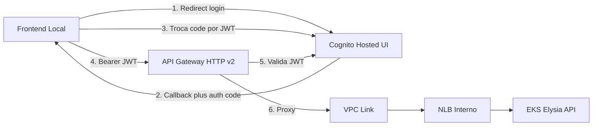

# ADR 015 — API Gateway HTTP API v2 + Cognito Hosted UI para Autenticação

| Campo      | Valor                |
|------------|----------------------|
| Status     | Aceito               |
| Data       | 2026-02-10           |
| Autor      | Arão Freitas         |

## Contexto

A arquitetura do sistema (HLD, sequence.md) define uma fase de autenticação antes do uso da API. Todas as rotas da API devem estar protegidas: apenas requisições com JWT válido devem alcançar o backend (Elysia no EKS). O ponto de entrada público deve ser único e seguro.

Requisitos:
- Autenticação gerenciada pela AWS, sem manter credenciais no backend
- Experiência de login simples para o usuário (incluindo teste local com frontend em localhost)
- Todas as rotas da API protegidas por JWT; exceção apenas para health check
- Reduzir boilerplate e superfície de ataque (menos código custom = menos bugs)

## Decisão

Adotar **API Gateway HTTP API (v2)** como único ponto de entrada público, com **Cognito User Pool** e **Hosted UI** para autenticação (email + senha). Zero Lambda triggers; fluxo OAuth2 Authorization Code.

### Arquitetura

### Componentes

| Componente | Escolha | Papel |
|------------|---------|--------|
| **Cognito User Pool** | Email como username, verificação de email, recuperação por email | Identidade e emissão de JWT |
| **Cognito Hosted UI** | Página de login/signup gerenciada pela AWS | Zero código custom de login |
| **Cognito User Pool Client** | OAuth2 authorization code, scopes openid/email/profile | Cliente para frontend (incl. localhost) |
| **API Gateway HTTP API v2** | JWT Authorizer nativo, VPC Link para NLB | Único endpoint público, validação de token |
| **Rota** `ANY /{proxy+}` | Com JWT Authorizer | Protege todas as rotas da API |
| **Rota** `GET /health` | Sem authorizer | Health checks e monitoramento |

### Fluxo OAuth2 (Authorization Code)

1. Frontend redireciona o usuário para a URL da Hosted UI (callback configurado, e.g. `http://localhost:3000/callback`).
2. Usuário faz login ou sign-up na página do Cognito.
3. Cognito redireciona para o callback com `?code=...`.
4. Frontend troca o `code` por tokens (access_token, id_token, refresh_token) via endpoint do Cognito.
5. Frontend envia `Authorization: Bearer <id_token ou access_token>` em todas as chamadas à API.
6. API Gateway valida o JWT com o issuer/audience do Cognito e encaminha a requisição ao backend via VPC Link → NLB → EKS.

## Justificativa

### Hosted UI vs autenticação custom (e.g. OTP com Lambda)

| Critério | Hosted UI (escolhido) | Custom (Lambda OTP) |
|----------|------------------------|----------------------|
| Código a manter | Nenhum | 3 Lambdas + IAM + SES |
| Segurança | Página e fluxo gerenciados pela AWS | Responsabilidade nossa |
| MFA / recuperação | Suportado pelo Cognito | Implementação manual |
| Boilerplate | Zero | Alto |

### HTTP API v2 vs REST API v1

| Critério | HTTP API v2 | REST API v1 |
|----------|-------------|-------------|
| Custo | $1,00 / milhão de requests | $3,50 / milhão |
| JWT Authorizer | Nativo (sem Lambda) | Lambda authorizer ou Cognito via configuração |
| Latência | Menor | Maior |
| VPC Link | Suportado | Suportado |

### Por que todas as rotas protegidas

- Consistência: não há rota “esquecida” sem proteção.
- Política única no API Gateway: JWT válido para `ANY /{proxy+}`; `/health` permanece público para probes e monitoramento.

## Consequências

### Positivas

- **Segurança**: Um único ponto de entrada; JWT validado antes de atingir o backend.
- **Menos código**: Nenhum Lambda de autenticação; Hosted UI cobre login/signup/recuperação.
- **Custo**: HTTP API v2 mais barato que REST API; Cognito dentro do free tier para volumes moderados.
- **Teste local**: Callback para `http://localhost:3000/callback` permite frontend local contra Cognito e API em “prod”.

### Negativas

- **Dependência do NLB**: API Gateway depende do VPC Link e do NLB criado pelo Kubernetes; o listener ARN deve ser conhecido após o deploy do EKS.
- **Configuração inicial**: Callback URLs e domínio Cognito precisam ser configurados (feito no Terraform do módulo `shared/auth`).

## Configuração (Terraform)

O módulo `shared/auth` no repositório fiap-image-terraform provisiona:

- Cognito User Pool, domínio (Hosted UI) e User Pool Client (callback localhost).
- API Gateway HTTP API, VPC Link, JWT Authorizer, integração com NLB, rotas `GET /health` e `ANY /{proxy+}`.

Variável obrigatória para o módulo: `nlb_listener_arn` (ARN do listener do NLB criado pelo Service da API no EKS).

## Custos estimados (ordem de grandeza)

| Recurso | Volume exemplo | Custo mensal |
|---------|----------------|--------------|
| API Gateway HTTP API | 1 M requests | ~\$1,00 |
| Cognito MAU | &lt; 50k usuários ativos | Free tier |
| VPC Link | 1 link | Sem custo adicional por link |

## Referências

- [Amazon API Gateway HTTP APIs](https://docs.aws.amazon.com/apigateway/latest/developerguide/http-api.html)
- [API Gateway JWT authorizer](https://docs.aws.amazon.com/apigateway/latest/developerguide/http-api-access-control-iam.html)
- [Cognito Hosted UI](https://docs.aws.amazon.com/cognito/latest/developerguide/cognito-user-pool-app-integration.html)
- [Authorization code grant (OAuth 2.0)](https://docs.aws.amazon.com/cognito/latest/developerguide/authorization-endpoint.html)
