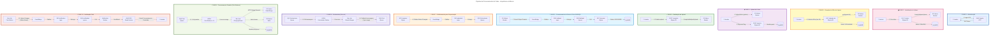

```mermaid
---
title: "Pipeline de Processamento de Vídeo - Arquitetura em Blocos"
---

graph TB
    subgraph FASE1["🔐 FASE 1 - Autenticação"]
        U1[👤 Usuário]
        C1[AWS Cognito<br/>OTP]
        U1 -->|"1. Login OTP"| C1
        C1 -->|"JWT Token"| U1
    end

    subgraph FASE2["📤 FASE 2 - Inicialização do Upload"]
        U2[👤 Usuário]
        API2[POST /videos<br/>Elysia API]
        S3_2[S3 Videos<br/>Bucket]
        DB2[(ScyllaDB)]

        U2 -->|"2. Cria vídeo"| API2
        API2 -->|"CreateMultipartUpload"| S3_2
        API2 -->|"Status: CREATED"| DB2
    end

    subgraph FASE3["🔗 FASE 3 - Geração de URLs de Upload"]
        U3[👤 Usuário]
        API3[GET /upload-urls<br/>Elysia API]
        S3_3[S3 Videos<br/>Bucket]
        DB3[(ScyllaDB)]

        U3 -->|"3. Solicita URLs (lote 20)"| API3
        API3 -->|"getSignedUrl()"| S3_3
        API3 -->|"Status: UPLOADING"| DB3
    end

    subgraph FASE4["⬆️ FASE 4 - Upload de Partes"]
        U4[👤 Usuário]
        S3_4[S3 Videos<br/>Bucket]
        API4[POST /parts/:n<br/>Elysia API]
        DB4[(ScyllaDB)]

        U4 -->|"4. Upload direto (partes)"| S3_4
        U4 -->|"5. Reporta ETag"| API4
        API4 -->|"Atualiza parte"| DB4
    end

    subgraph FASE5["✅ FASE 5 - Finalização do Upload"]
        U5[👤 Usuário]
        API5[POST /complete<br/>Elysia API]
        S3_5[S3 Videos<br/>Bucket]

        U5 -->|"6. Finaliza upload"| API5
        API5 -->|"CompleteMultipartUpload"| S3_5
    end

    subgraph FASE6["🔔 FASE 6 - Processamento de Evento S3 via SNS/SQS"]
        S3_6[S3 Videos<br/>Bucket]
        EB6[EventBridge]
        SNS6[SNS multipart<br/>topic]
        SQS6[SQS Multipart<br/>Queue]
        API6[API Consumer<br/>Elysia]
        DB6[(ScyllaDB)]

        S3_6 -->|"7. Event: Object Created"| EB6
        EB6 -->|"Publica"| SNS6
        SNS6 -->|"Entrega"| SQS6
        SQS6 -->|"Poll"| API6
        API6 -->|"Status: UPLOADED"| DB6
    end

    subgraph FASE7["🎯 FASE 7 - Enfileiramento para Orquestração"]
        API7[API Consumer<br/>Elysia]
        EB7[EventBridge]
        SNS7[SNS uploaded<br/>topic]
        SQS7[SQS Orchestrator<br/>Queue]

        API7 -->|"8. Publica Status Changed"| EB7
        EB7 -->|"Publica"| SNS7
        SNS7 -->|"Entrega"| SQS7
    end

    subgraph FASE8["🔄 FASE 8 - Orchestrator (Fan-out)"]
        SQS8[SQS Orchestrator<br/>Queue]
        KEDA8[KEDA<br/>Orchestrator Worker]
        JOB8[Bun Job<br/>Calcula Ranges]
        SQSP8[SQS Print<br/>Queue]

        SQS8 -->|"9. Poll mensagem"| KEDA8
        KEDA8 -->|"Processa"| JOB8
        JOB8 -->|"10. Publica N mensagens<br/>(1 por range)"| SQSP8
    end

    subgraph FASE9["⚡ FASE 9 - Processamento Paralelo (Print Workers)"]
        SQSP9[SQS Print<br/>Queue]
        KEDA9[KEDA<br/>Print Workers × N]
        JOB9[Bun Job<br/>FFmpeg Extract]
        S3V9[S3 Videos<br/>Read Range]
        S3F9[S3 Frames<br/>Write]
        DB9[(ScyllaDB)]

        SQSP9 -->|"11. Poll paralelo"| KEDA9
        KEDA9 -->|"Processa range"| JOB9
        JOB9 -->|"HTTP Range Request"| S3V9
        JOB9 -->|"Salva frames"| S3F9
        JOB9 -->|"Atualiza progresso"| DB9
    end

    subgraph FASE10["📧 FASE 10 - Notificação Final"]
        JOB10[Bun Job<br/>Print Worker]
        EB10[EventBridge]
        SNS10[SNS notification<br/>topic]
        SQS10[SQS notification<br/>queue]
        NW10[Notification<br/>Worker]
        SES10[AWS SES<br/>Email Service]
        U10[👤 Usuário]

        JOB10 -->|"12. Status Changed<br/>(último frame)"| EB10
        EB10 -->|"Publica"| SNS10
        SNS10 -->|"Entrega"| SQS10
        SQS10 -->|"Poll"| NW10
        NW10 -->|"SendEmail"| SES10
        SES10 -->|"Email: Processamento Concluído"| U10
    end

    style FASE1 fill:#e3f2fd,stroke:#0d47a1,stroke-width:3px
    style FASE2 fill:#fce4ec,stroke:#c2185b,stroke-width:3px
    style FASE3 fill:#fff9c4,stroke:#f57f17,stroke-width:3px
    style FASE4 fill:#f3e5f5,stroke:#7b1fa2,stroke-width:3px
    style FASE5 fill:#e8f5e9,stroke:#2e7d32,stroke-width:3px
    style FASE6 fill:#e1f5fe,stroke:#0277bd,stroke-width:3px
    style FASE7 fill:#fff3e0,stroke:#e65100,stroke-width:3px
    style FASE8 fill:#ede7f6,stroke:#4527a0,stroke-width:3px
    style FASE9 fill:#f1f8e9,stroke:#33691e,stroke-width:3px
    style FASE10 fill:#fbe9e7,stroke:#bf360c,stroke-width:3px
```