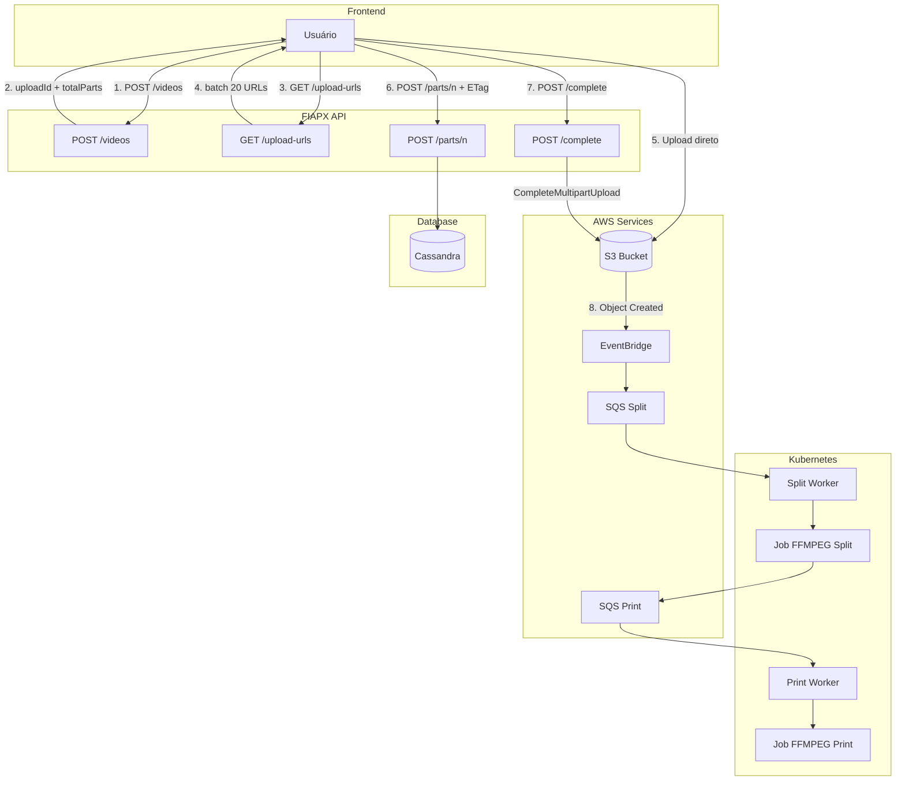
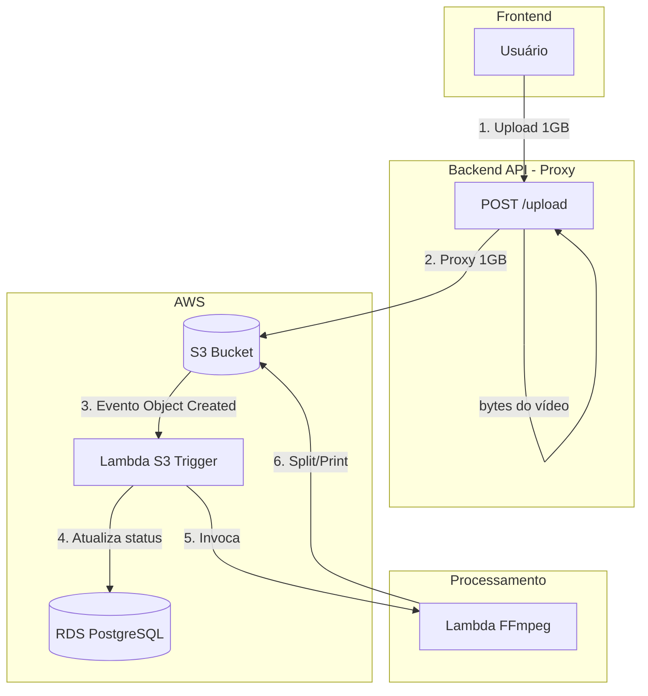
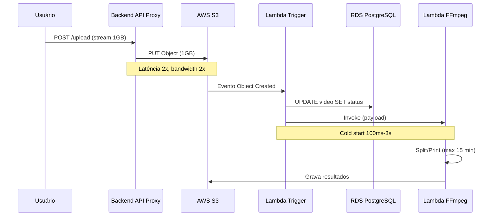
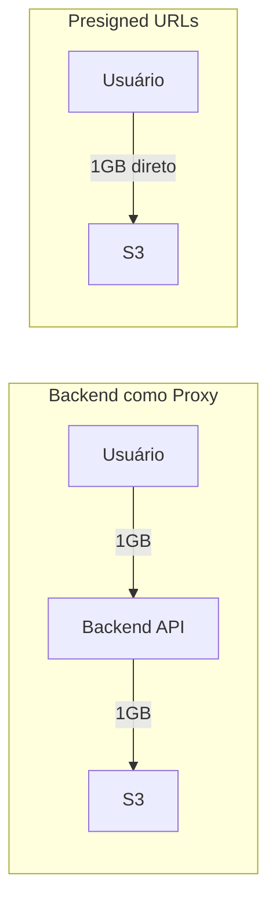
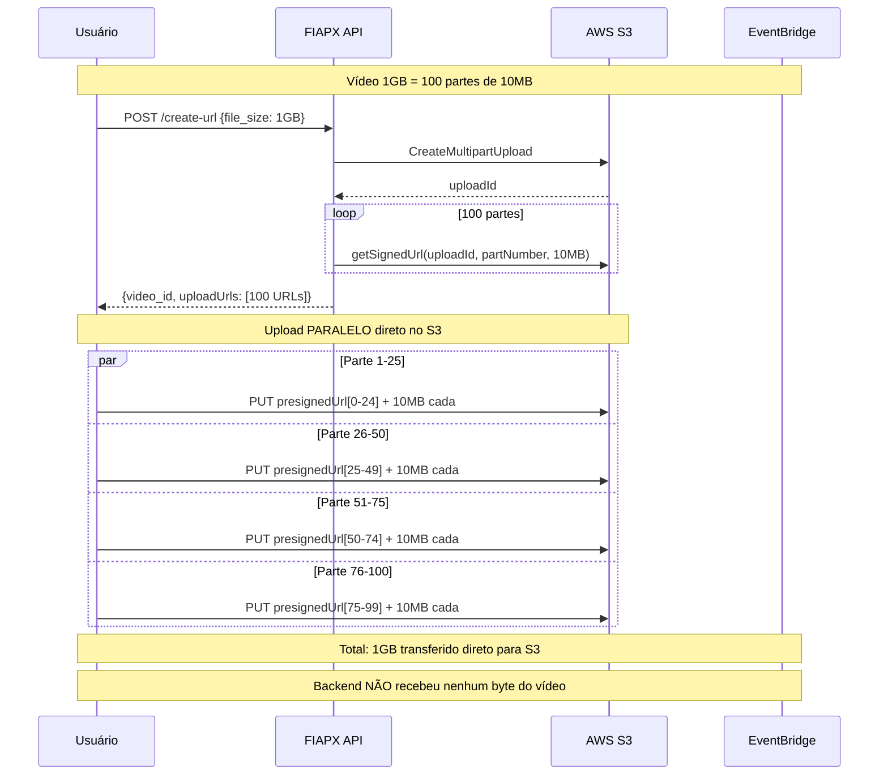
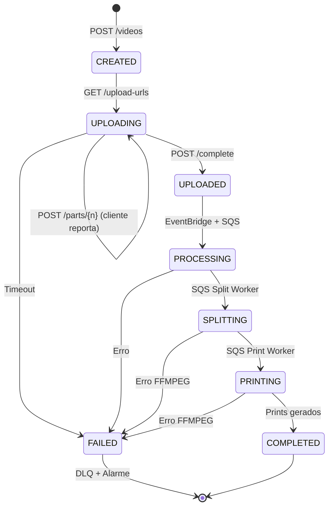
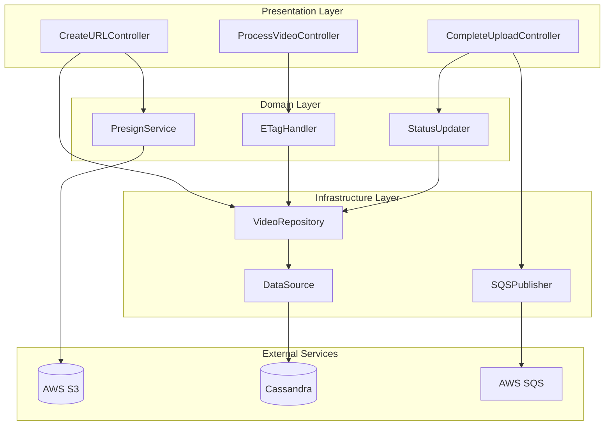
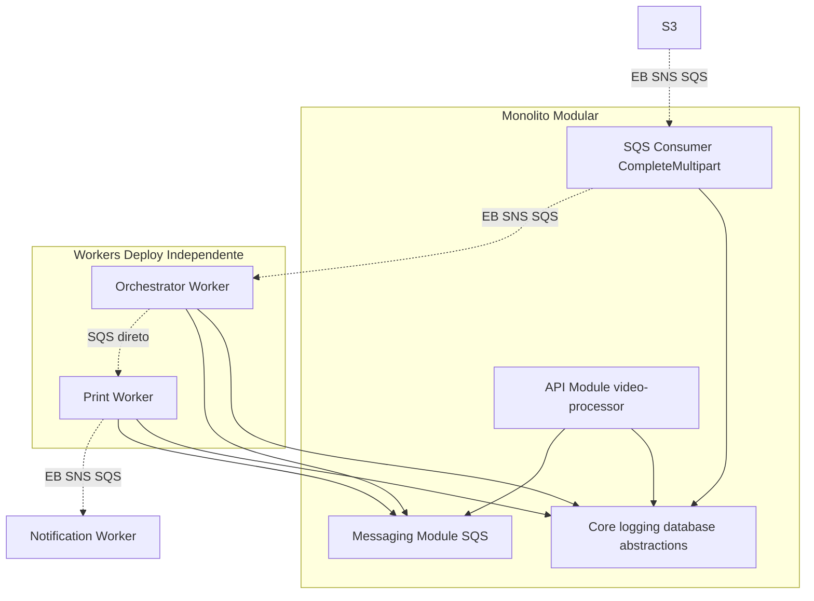
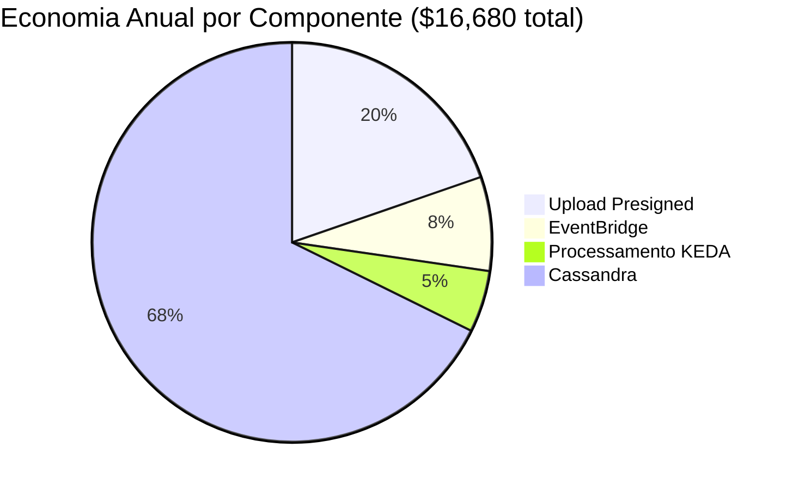

# Justificativa de Infraestrutura - Video Processor

## Documento Técnico

---

## Premissas de Cálculo

| Parâmetro | Valor |
|-----------|-------|
| **Tamanho do vídeo** | 1 GB |
| **Duração do vídeo** | 1 hora (60 min) |
| **Tamanho da parte (multipart)** | 10 MB |
| **Partes por vídeo** | 100 partes |
| **Eventos S3 por vídeo** | 1 (apenas CompleteMultipartUpload) |

> **IMPORTANTE**: O S3 **NÃO emite eventos para UploadPart**. Apenas `CompleteMultipartUpload` gera evento no EventBridge.

---

## 1. Visão Geral da Arquitetura



> **Nota**: O S3 só emite evento após `CompleteMultipartUpload`. O progresso das partes é reportado pelo cliente via `POST /parts/{n}`.

---

## 2. Arquitetura Tradicional (Referência)

Esta seção descreve a **arquitetura tradicional completa** usada como baseline de comparação nas decisões deste documento. Ela reúne upload via proxy, Lambda como intermediário de eventos e RDS como banco.

### Visão da Arquitetura Tradicional



### Stack de Componentes

| Componente | Função na arquitetura tradicional |
|------------|-----------------------------------|
| **Backend API (EC2/ECS)** | Recebe o upload do cliente (proxy); envia bytes ao S3; consome CPU/RAM e bandwidth |
| **S3** | Armazena o vídeo enviado pelo backend (não pelo cliente) |
| **Lambda (S3 trigger)** | Intermediário: disparada pelo evento S3, atualiza banco, invoca próxima Lambda |
| **RDS PostgreSQL** | Banco relacional para vídeos, partes e metadados; escalabilidade vertical |
| **Lambda FFmpeg** | Processamento Split/Print; limite 15 min, payload 6 MB; cold start |

### Fluxo Completo (Sequência)



### Limitações e Problemas

| Área | Problema |
|------|----------|
| **Upload** | Backend recebe e reenvia 1GB por vídeo: latência 2x, custo de data transfer 2x, necessidade de servidor maior (4 vCPU, 8 GB RAM) |
| **Eventos** | Lambda como intermediário: cold start, custo por execução, limite de concorrência (1.000 simultâneas por padrão), código extra para manter |
| **Processamento** | Lambda: timeout 15 min, payload 6 MB; para vídeo 1h e 100 partes exige orquestração e mais Lambdas |
| **Banco** | RDS: escalabilidade vertical, sharding manual, custo maior (~$1.500/mês para Multi-AZ) |
| **Custo total** | Para 10.000 vídeos/mês: ~$2.030/mês (proxy + Lambda + RDS + processamento) |

As seções seguintes justificam a substituição de cada um desses componentes pela arquitetura proposta (Presigned URLs, EventBridge + SQS, Cassandra, KEDA Workers).

---

## 3. Presigned URLs - Upload Direto no S3

### Por que NÃO usar o Backend como Proxy?

A abordagem tradicional de upload passa o arquivo pelo backend antes de enviar ao S3. Isso gera:
- **Latência duplicada**: o arquivo viaja duas vezes (usuário → backend → S3)
- **Custo adicional**: pagamos pelo tráfego de entrada e saída no servidor
- **Carga no servidor**: CPU e RAM consumidos para processar bytes que apenas "passam"

### Arquitetura Comparada



**Backend como Proxy:**
- Latência 2x
- Custo bandwidth 2x
- CPU/RAM do servidor ocupados

**Presigned URLs:**
- Latência 1x
- Zero bandwidth no backend
- Zero CPU/RAM para upload

### Fluxo Detalhado com Presigned URLs



### Comparativo de Custos - Presigned vs Proxy

**Cenário: 1.000 vídeos de 1GB/mês**

| Métrica | Backend como Proxy | Presigned URLs | Economia |
|---------|-------------------|----------------|----------|
| **Bandwidth IN (API)** | 1.000 GB | 0 GB | 100% |
| **Bandwidth OUT (API)** | 1.000 GB | 0 GB | 100% |
| **Custo Data Transfer** | $180/mês | $0/mês | $180 |
| **CPU necessário** | 4 vCPU | 0.5 vCPU | 87% |
| **RAM necessária** | 8 GB | 1 GB | 87% |
| **Custo EC2 (m5.xlarge)** | $140/mês | $0 | $140 |
| **Latência upload** | 2x (ida e volta) | 1x (direto) | 50% |
| **Tempo upload 1GB** | ~4 min | ~2 min | 50% |
| **Total mensal** | **$320/mês** | **$0/mês** | **$320** |

### Vantagens das Presigned URLs

| Vantagem | Descrição |
|----------|-----------|
| **Zero Proxy** | Backend não recebe bytes do vídeo |
| **Latência 50% menor** | Upload direto, sem hop intermediário |
| **Bandwidth grátis** | Sem custo de data transfer no backend |
| **Escalabilidade infinita** | S3 escala automaticamente |
| **Upload paralelo** | Múltiplas partes simultâneas |
| **Retry granular** | Falha de 1 parte não afeta outras 99 |
| **Segurança** | URL expira em X minutos |
| **Menos infra** | Servidor menor, menos custo |

### Cálculo de Tempo de Upload

| Cenário | Backend Proxy | Presigned URLs |
|---------|--------------|----------------|
| **1 vídeo 1GB** | 4 min | 2 min |
| **10 vídeos 1GB** | 40 min | 5 min (paralelo) |
| **100 vídeos 1GB** | 400 min | 20 min (paralelo) |

---

## 4. EventBridge vs Lambda

### Por que NÃO usar Lambda?

A abordagem tradicional usa Lambda como intermediário entre eventos S3 e a API:

```
S3 Event → Lambda → API Call
```

**Problemas:**
- **Cold Start**: 100ms a 3s de latência adicional
- **Custo de compute**: pagamos por tempo de execução
- **Código para manter**: mais uma função para versionar/deploy
- **Limites de concorrência**: 1000 execuções simultâneas por padrão

### Arquitetura com EventBridge + SNS + SQS (Fan-out)

```
S3 Event → EventBridge → SNS Topic → SQS Queue → Consumer
```

**Vantagens:**
- **Zero Cold Start**: não há runtime para inicializar
- **Fan-out nativo**: SNS distribui para múltiplos subscribers
- **Resiliência em camadas**: EventBridge → SNS → SQS → DLQ
- **Extensibilidade**: novos consumers sem alterar EventBridge
- **Custo quase zero**: SNS entrega para SQS é grátis

### Comparativo de Performance

| Métrica | Lambda | EventBridge + SNS + SQS |
|---------|--------|--------------------------|
| **Cold Start** | 100ms - 3s (Java/Python) | 0ms (sem runtime) |
| **Latência média** | 50-200ms | 25-60ms |
| **Latência p99** | 500ms - 3s | 150ms |
| **Fan-out** | Manual | Nativo (SNS) |
| **Retry** | Configurável | 3 camadas (EB + SNS + SQS) |

### Comparativo de Custos

**Cenário: Vídeos de 1GB com 100 partes cada**

> **Nota**: O S3 emite apenas **1 evento por vídeo** (`CompleteMultipartUpload`), não 100 eventos por parte.

| Volume | Eventos S3/mês | EventBridge | SQS | Total |
|--------|----------------|-------------|-----|-------|
| **100 vídeos** | 100 | $0.0001 | $0.00004 | ~$0.01 |
| **1.000 vídeos** | 1.000 | $0.001 | $0.0004 | ~$0.01 |
| **10.000 vídeos** | 10.000 | $0.01 | $0.004 | ~$0.02 |
| **100.000 vídeos** | 100.000 | $0.10 | $0.04 | ~$0.14 |

**Cálculo EventBridge:**
- $1.00 / 1M eventos
- 10k vídeos = 10k eventos = $0.01

**Cálculo SQS:**
- $0.40 / 1M requests
- 10k vídeos = ~10k mensagens = $0.004

**Por que tão barato?**
O S3 NÃO emite eventos para cada parte (`UploadPart`). Apenas `CompleteMultipartUpload` gera evento.

### Reconciliação: CompleteMultipartUpload como Fonte de Verdade

Se o evento `CompleteMultipartUpload` chegou, **o upload está 100% completo no S3**. O S3 só aceita completar o upload se todas as partes foram enviadas com sucesso.

**Lógica de reconciliação:**
- Quando o evento chega via EventBridge, o sistema atualiza **todas as partes** e o **vídeo** para status `UPLOADED`
- Isso garante consistência mesmo se o cliente não reportou algumas partes via `POST /parts/{n}`
- O evento do S3 é a fonte de verdade, não o cliente

```
Cenário: Cliente crashou após upload mas antes de reportar
├─ Todas as partes foram enviadas ao S3 ✓
├─ Cliente não chamou POST /parts/{n} para algumas partes
├─ Cliente não chamou POST /complete
│
├─ S3 emite CompleteMultipartUpload via EventBridge
│
└─ API reconcilia: marca TUDO como UPLOADED e inicia processamento ✓
```

### Vantagens Adicionais do EventBridge + SNS

| Vantagem | Descrição |
|----------|-----------|
| **Fan-out nativo** | SNS distribui para múltiplos consumers |
| **Schema Registry** | Validação automática de eventos |
| **Archive & Replay** | Re-processar eventos históricos |
| **Cross-Account** | Enviar eventos entre contas AWS |
| **SaaS Integration** | Integração nativa com Datadog, Zendesk, etc |
| **Dead Letter Queue** | Built-in em EventBridge, SNS e SQS |
| **Extensibilidade** | Novos subscribers sem alterar EventBridge |

---

## 5. Por que Banco Colunar e NÃO Relacional?

### O Problema com Bancos Relacionais

Para um sistema de processamento de vídeos, temos:
- **Alto volume de escritas**: cada parte do vídeo gera um registro
- **Queries simples**: sempre por `video_id` (partition key)
- **Sem JOINs complexos**: dados desnormalizados por design
- **Necessidade de escalar**: picos de processamento

Bancos relacionais (PostgreSQL, MySQL) têm:
- **Escalabilidade vertical**: mais CPU/RAM = mais caro
- **Sharding manual**: complexo de implementar e manter
- **Locks em escrita**: contenção em alto throughput
- **Overhead ACID**: transações que não precisamos

### Por que NÃO Document Store (MongoDB)?

| Critério | MongoDB | Cassandra |
|----------|---------|-----------|
| **Latência p99** | 5-10ms | 10-50ms |
| **Write throughput** | ~100K ops/s | ~100K ops/s |
| **Custo de memória** | Alto (índices em RAM) | Moderado |
| **Consistência** | Configurável | Tunable por query |
| **Document locking** | Sim (updates frequentes) | Não |
| **Storage overhead** | Alto (BSON) | Baixo |

**Desvantagens do MongoDB para este caso:**
- Índices secundários consomem muita RAM
- Document locking em updates frequentes (status do vídeo)
- Custo de storage maior (BSON overhead)
- Não é otimizado para time-series data

### Cassandra vs Alternativas

| Critério | PostgreSQL | MongoDB | Cassandra | ScyllaDB |
|----------|------------|---------|-----------|----------|
| **Escalabilidade** | Vertical | Horizontal | Horizontal | Horizontal |
| **Write throughput** | 10K/s | 100K/s | 100K/s | 1M+/s |
| **Latência p99** | 5-20ms | 5-10ms | 10-50ms | 1-2ms |
| **GC Pauses** | N/A | Sim | Sim (JVM) | Zero |
| **Compatibilidade** | SQL | MongoDB | CQL | CQL 100% |

**Decisão (ADR 003):** Cassandra foi escolhido para balancear custo, escalabilidade e simplicidade operacional em fase de startup. O pipeline assíncrono tolera latência p99 de ~10-50ms.

---

## 6. Por que Cassandra e NÃO ScyllaDB?

### Decisão (ADR 003)

Usar **Cassandra (wide-column)** para balancear custo, escalabilidade e simplicidade operacional. ScyllaDB oferece maior performance e menor latência, mas o custo de operação é elevado para uma startup em fase inicial.

### Por que NÃO ScyllaDB (nesta fase)?

- **Custo operacional**: ScyllaDB Cloud ou self-managed com sizing adequado tem custo maior que Cassandra em 3 nós
- **Orçamento de startup**: Prioridade é velocidade de entrega e custo controlado
- **Pipeline assíncrono**: O processamento de vídeo leva minutos; latência p99 de ~10-50ms do Cassandra é aceitável

### O que o Cassandra entrega

- **Compatibilidade CQL**: Mesmo modelo de dados e drivers que permitiriam migrar para ScyllaDB no futuro
- **Ecossistema maduro**: Documentação e suporte da comunidade
- **Query-first design**: Camada de persistência abstrata (repositórios) desacopla a aplicação do banco
- **Escalabilidade horizontal**: Adicionar nós ou migrar para ScyllaDB depois é viável

### Comparativo (contexto da decisão)

| Métrica | Cassandra | ScyllaDB |
|---------|-----------|----------|
| **Latência p99** | 10-50ms | 1-2ms |
| **Throughput** | 100K ops/s/node | 1M+ ops/s/node |
| **Custo operacional** | Menor (escolhido) | Maior |
| **Compatibilidade CQL** | Nativo | 100% |
| **Driver** | cassandra-driver | cassandra-driver (mesmo!) |

### Código atual (driver CQL)

```typescript
// src/core/libs/database/datasource.ts
import cassandra from 'cassandra-driver'

this.client = new cassandra.Client({
  contactPoints: ['cassandra-node1', 'cassandra-node2'],
  keyspace: 'fiap_image',
  localDataCenter: 'datacenter1',
})
```

Migração futura para ScyllaDB exigiria apenas troca de `contactPoints` e tuning; o modelo de dados permanece.

### Comparativo de Custos - Banco de Dados

**Cenário: 10.000 vídeos/mês, 100K queries/hora**

| Solução | Configuração | Custo/mês | TCO Anual |
|---------|--------------|-----------|-----------|
| **RDS PostgreSQL** | db.r6g.2xlarge Multi-AZ | $1,500 | $18,000 |
| **RDS + Read Replicas** | 1 primary + 2 replicas | $3,000 | $36,000 |
| **MongoDB Atlas** | M40 (3 nodes) | $1,200 | $14,400 |
| **AWS Keyspaces** | On-demand | $800 | $9,600 |
| **ScyllaDB Cloud** | i3.xlarge (3 nodes) | $600 | $7,200 |
| **Cassandra (3 nodes)** | 3x m5.xlarge EC2 | $400 | $4,800 |

**Economia Cassandra vs RDS: 73-87%**

---

## 7. Modelo de Dados Query-First

### Design Orientado a Queries

Em bancos colunares, o schema é desenhado para as queries que serão executadas:

```sql
-- Query 1: Buscar vídeo por ID
SELECT * FROM videos_by_id WHERE video_id = ?

-- Query 2: Buscar todas as partes de um vídeo
SELECT * FROM video_parts_by_video WHERE video_id = ?

-- Query 3: Buscar metadados do vídeo
SELECT * FROM video_metadata_by_video WHERE video_id = ?

-- Query 4: Buscar integrações do vídeo
SELECT * FROM integrations_by_video WHERE video_id = ?
```

**Todas as queries são O(1)** - partition key leva direto ao nó correto.

### Schema Otimizado para Vídeos 1GB/1hora

Relacionamentos: `videos_by_id` contém N `video_parts_by_video`, tem 1 `video_metadata_by_video`, integra N `integrations_by_video`; `integrations_by_video` referencia `third_party_integrations`.

```text
videos_by_id
  video_id (PK), status, created_at, updated_at

video_parts_by_video
  video_id (PK), part_number (CK), size (~10MB/parte), duration (~36s/parte), created_at, updated_at

video_metadata_by_video
  video_id (PK), total_size (1GB), duration (3600s), parts_urls (100 URLs), created_at, updated_at

integrations_by_video
  video_id (PK), integration_id (CK), third_party_video_id, third_party_name, created_at, updated_at
```

### Dados por Vídeo de 1GB/1hora

| Tabela | Registros | Tamanho Estimado |
|--------|-----------|------------------|
| `videos_by_id` | 1 | ~100 bytes |
| `video_parts_by_video` | 100 | ~5 KB |
| `video_metadata_by_video` | 1 | ~10 KB |
| `integrations_by_video` | 1-5 | ~500 bytes |
| **Total por vídeo** | ~105 | **~16 KB** |

### Vantagens do Design

| Vantagem | Descrição |
|----------|-----------|
| **Partition Key** | `video_id` garante todos os dados no mesmo nó |
| **Clustering Key** | `part_number` ordena partes automaticamente |
| **Desnormalização** | Zero JOINs, latência O(1) |
| **Time-series** | `created_at`/`updated_at` para auditoria |
| **Escalabilidade** | Novos vídeos distribuídos automaticamente |

---

## 8. Alta Disponibilidade e Consistência Eventual

### Por que Consistência Eventual é Aceitável?

O processamento de vídeo é **inerentemente assíncrono**:

```mermaid
gantt
    title Timeline de Processamento - 1 Vídeo 1GB/1hora
    dateFormat s
    axisFormat %M:%S

    section Upload
    Gerar URLs (batch 20)  :0, 1
    Upload 100 partes      :1, 120
    Cliente reporta ETags  :1, 120

    section Eventos
    1 evento EB (Complete) :121, 122

    section Processamento
    Split 60 segmentos :130, 180
    Print 3600 frames  :180, 300

    section Total
    Fim do processo    :300, 301
```



**Tempo total: ~5 minutos**

A consistência eventual (milissegundos) é **irrelevante** para um processo que leva **minutos**.

### Fluxo de Estados do Vídeo



### Justificativas para Consistência Eventual

| Justificativa | Descrição |
|---------------|-----------|
| **Processamento assíncrono** | Usuário recebe 202 Accepted imediatamente |
| **Sem transações ACID** | Cada operação é idempotente |
| **Tolerância a falhas** | Retry automático resolve inconsistências |
| **Leitura eventual** | Usuário consulta status via polling/webhook |
| **SQS garante entrega** | Mensagens não são perdidas |
| **DLQ para falhas** | Reprocessamento manual quando necessário |

### Configuração de Alta Disponibilidade

| Característica | Valor |
|----------------|-------|
| **Replication Factor** | 3 (cada dado em 3 nós) |
| **Consistency Level (escrita)** | QUORUM (2 de 3) |
| **Consistency Level (leitura)** | ONE (leitura rápida) |
| **Tolerância a falhas** | 2 nós podem cair |
| **Arquitetura** | Masterless (zero SPOF) |
| **SLA** | 99.99% uptime |
| **Recovery automático** | Nó volta e sincroniza |

---

## 9. Desacoplamento e Ganhos Arquiteturais

### Arquitetura em Camadas



### Ganhos do Desacoplamento

| Ganho | Descrição |
|-------|-----------|
| **Testabilidade** | Mock de Repository e Services para testes unitários |
| **Flexibilidade** | Trocar Cassandra sem alterar domínio |
| **Manutenibilidade** | Separação clara de responsabilidades |
| **Escalabilidade** | API, Workers e Jobs escalam independentemente |
| **Event-driven** | EventBridge desacopla upload de processamento |
| **Observabilidade** | Logs estruturados e métricas por camada (event, resource, duration); log-based metrics no Datadog (ADR 016) |

### Exemplo de Teste Unitário

```typescript
// Mock do Repository
const mockRepo = {
  create: jest.fn().mockResolvedValue(Result.ok(undefined)),
}

// Teste do Controller sem banco real
const controller = new CreateURLController(mockRepo)
await controller.handle({ file_size: 1_000_000_000 })

expect(mockRepo.create).toHaveBeenCalledWith(
  expect.objectContaining({ status: 'pending' })
)
```

---

## 10. Conclusão

### Decisões e Justificativas

| Decisão | Justificativa | Economia |
|---------|---------------|----------|
| **Presigned URLs** | Zero proxy, latência 50% menor, escalabilidade infinita | $320/mês |
| **EventBridge** | Zero cold start, sem código, custo por evento | $84/mês |
| **Cassandra** | Custo menor que ScyllaDB/RDS, CQL, pipeline assíncrono tolera p99 ~10-50ms (ADR 003) | $1,100/mês |
| **Query-First Design** | Latência O(1), zero JOINs, partition key | Performance |
| **Consistência Eventual** | Processo leva minutos, ACID desnecessário | Simplificação |
| **Desacoplamento** | Testabilidade, flexibilidade, manutenibilidade | Qualidade |

### Resumo Executivo

- **Economia total**: 79% de redução no TCO ($18,048/ano)
- **Performance**: Latência p99 ~10-50ms (Cassandra), aceitável para pipeline assíncrono
- **Escalabilidade**: Horizontal, automática, sem limites
- **Disponibilidade**: 99.99% SLA, zero single point of failure
- **Manutenibilidade**: Zero código Lambda, infraestrutura declarativa

---

## 11. Arquitetura Final: EventBridge + SQS + KEDA

### Decisão Arquitetural

A arquitetura final adota **EventBridge + SNS + SQS + KEDA Workers** como solução:

| Componente | Solução | Justificativa |
|------------|---------|---------------|
| **Monitoramento de Upload** | Cliente reporta via API | S3 NÃO emite eventos para UploadPart |
| **Detecção de Conclusão** | EventBridge → SNS → SQS | Fan-out nativo, resiliência em camadas |
| **Processamento Split/Print** | SNS → SQS + KEDA Worker + K8s Jobs | Sem limite de tempo, FFmpeg CLI |
| **Notificações** | EventBridge → SNS → SQS → Notification Worker | Event-driven, fan-out, extensível |

### Limitação Importante do S3

**O S3 NÃO emite eventos para cada parte individual (`UploadPart`)!**

Eventos disponíveis via EventBridge:

| Evento S3 | Disponível? | Uso |
|-----------|-------------|-----|
| `UploadPart` | **NÃO** | - |
| `CompleteMultipartUpload` | **SIM** | Dispara processamento |
| `PutObject` | SIM | Objetos simples |

Por isso, o **cliente deve reportar progresso** após cada parte via `POST /videos/{id}/parts/{n}`.

### Fluxo de Eventos

```
Upload de Partes (cliente reporta):
Cliente → S3 (PUT parte) → Cliente recebe ETag
                                  ↓
                         API (POST /parts/{n})
                                  ↓
                             Cassandra

Conclusão do Upload (EventBridge → SNS → SQS):
S3 (CompleteMultipartUpload) → EventBridge → SNS → SQS → API Consumer

Orquestração (EventBridge → SNS → SQS):
API emite UPLOADED → EventBridge → SNS → SQS → Orchestrator Worker

Notificações (EventBridge → SNS → SQS):
Workers emitem PROCESSING/COMPLETED/FAILED → EventBridge → SNS → SQS → Notification Worker → SES
```

### Geração Progressiva de URLs (ADR 006)

URLs pré-assinadas geradas em batches de 20 sob demanda:

| Parâmetro | Valor |
|-----------|-------|
| Batch Size | 20 URLs |
| Expiration | 15 min |
| Max Parts | 10.000 |

### Comparativo Lambda vs KEDA (ADR 008)

| Workload | Lambda | KEDA | Recomendação |
|----------|--------|------|--------------|
| **Split/Print** | $85/mês | $3.80/mês | KEDA (95% economia) |
| **Notificações** | $0.50/mês | $15/mês | Lambda (97% economia) |

---

## 12. Preços AWS Atualizados (us-east-1, Janeiro 2026)

### EventBridge

| Recurso | Preço |
|---------|-------|
| Custom Events | $1.00/milhão |
| Partner Events | $1.00/milhão |
| Schema Discovery | $0.10/milhão (após 5M free) |

### SNS (Standard Topics)

| Recurso | Preço |
|---------|-------|
| Publicações | $0.50/milhão (primeiro 1M grátis) |
| Entregas para SQS | **Grátis** |
| Entregas para Lambda | **Grátis** |
| Entregas para HTTP/S | $0.60/milhão |
| Data Transfer (mesma região) | **Grátis** |

### SQS

| Recurso | Preço |
|---------|-------|
| Standard Queue | $0.40/milhão requests |
| FIFO Queue | $0.50/milhão requests |
| Data Transfer (in) | Grátis |
| Data Transfer (out, mesma região) | Grátis |

### Lambda

| Recurso | Preço (ARM/Graviton) |
|---------|---------------------|
| Requests | $0.20/milhão |
| Duration | $0.0000133334/GB-segundo |
| Free Tier | 1M requests + 400k GB-s/mês |

### S3

| Recurso | Preço |
|---------|-------|
| PUT/COPY/POST/LIST | $0.005/1.000 requests |
| GET/SELECT | $0.0004/1.000 requests |
| Storage (Standard) | $0.023/GB-mês |
| Data Transfer (out) | $0.09/GB (primeiros 10TB) |

### SNS

| Recurso | Preço |
|---------|-------|
| Publicações | $0.50/milhão |
| Entregas HTTP/S | $0.60/milhão |
| Entregas Lambda | Grátis |
| Email (SES) | $0.10/1.000 emails |

---

## 13. Monolito Modular com Workers (ADR 009)

### Decisão

Adotar **monolito modular com workers deployáveis independentemente**: um único repositório, boundaries claros por pastas, comunicação event-driven (SQS + EventBridge) e deploy independente (Dockerfiles separados para API e workers). Ver [ADR 009](adrs/09.md).

### Justificativa para startup

- **Velocidade de desenvolvimento**: um repositório, um `bun install`, refatoração fácil
- **Custo operacional baixo**: sem overhead de múltiplos repositórios nem contratos entre times
- **Evolução incremental**: arquitetura que cresce com o produto; microserviços seriam prematuros

### Estrutura do monorepo

```
fiap-image/
├── src/
│   ├── core/                    # Código compartilhado (logging, database, abstractions)
│   ├── modules/
│   │   ├── video-processor/     # Módulo da API
│   │   └── messaging/sqs/       # Abstração SQS reutilizável
│   └── index.ts                 # Entrypoint da API
├── workers/
│   └── src/
│       ├── split-worker.ts
│       ├── print-worker.ts
│       └── ffmpeg.service.ts
├── Dockerfile.api
├── Dockerfile.workers
└── package.json
```

### Boundaries e fluxo

| Aspecto | Implementação |
|---------|---------------|
| **Codebase** | Único (monorepo) |
| **Módulos** | Boundaries claros via pastas |
| **Comunicação** | Event-driven (SQS + EventBridge) |
| **Deploy** | Independente (API vs Workers) |
| **Compartilhamento** | Core libs importadas diretamente |



### Fluxo de eventos (resumo)

```
S3 CompleteMultipartUpload → EventBridge → SNS → SQS (multipart-complete-queue)
       → API Consumer (atualiza DB, emite UPLOADED)
       → EventBridge → SNS → SQS (orchestrator-queue) → orchestrator-worker
       → SQS (print-queue) → print-workers
       → EventBridge → SNS → SQS (notification-queue) → SES
```

### Regras de dependência (workers)

- **Podem importar**: `src/core/libs/logging/`, `src/core/abstractions/messaging/`, `src/modules/messaging/sqs/`
- **Não podem importar**: `src/modules/video-processor/`, `src/modules/docs/`, `src/index.ts`

### Caminho para microserviços

A comunicação já é assíncrona (SQS/EventBridge); uma migração futura para microserviços seria basicamente extrair `@fiapx/core` e mover workers para outro repositório, com esforço estimado de 2–4 horas.

---

## 14. Arquivamento de Vídeos Raw em S3 Glacier Instant Retrieval (ADR 013)

### Problema

Após o processamento, o vídeo raw de 1GB permanece em S3 Standard ($0.023/GB/mês). Para 10.000 vídeos isso representa ~$230/mês (~$2.760/ano). O vídeo original raramente é acessado após o processamento, mas deve permanecer disponível para download eventual, reprocessamento e auditoria.

### Decisão (ADR 013)

Transicionar vídeos raw para **S3 Glacier Instant Retrieval** após a conclusão do processamento, usando o evento `COMPLETED` já existente. O **PrintWorker** aplica a tag `archive-status: ready` no objeto S3 ao concluir; uma **S3 Lifecycle Rule** com filtro por prefixo e tag transiciona para a classe `GLACIER_IR`. Ver [ADR 013](adrs/13.md).

### Fluxo de arquivamento

```
PrintWorker (último segmento) → aplica tag no S3 (archive-status: ready)
       ↓
   EventBridge: COMPLETED → SES (email)
       ↓
   S3 Lifecycle (prefix videos/raw/ + tag) → transição para Glacier Instant Retrieval
```

### Por que Glacier Instant Retrieval?

| Critério | Glacier IR | Deep Archive |
|----------|------------|--------------|
| Acesso | Imediato (ms) | 12-48 horas |
| Storage | $0.004/GB | $0.00099/GB |
| Retrieval | $0.03/GB | $0.02/GB |
| UX Download | Transparente (presigned URLs iguais) | Inviável (espera horas) |

Glacier IR mantém a experiência de download imediato para o usuário.

### Economia e break-even

- **Economia de storage**: ~83% (~$2.100/ano para 10k vídeos, cenário 5% de downloads)
- **Break-even**: até ~63% de downloads/mês, Glacier IR é mais econômico que manter tudo em Standard

| % Downloads/mês | Standard | Glacier IR | Economia |
|-----------------|----------|------------|----------|
| 5% | $0.023/GB | ~$0.0055/GB | ~76% |
| 63% | $0.023/GB | $0.023/GB | 0% |

---

## 15. Observabilidade e Log-based Metrics (ADR 016)

### Importância da observabilidade

A observabilidade permite visibilidade por camada (HTTP, SQS, domínio vídeo), medir latência e taxa de sucesso por operação e rastrear erros sem instrumentação adicional de APM em todo o código. Logs estruturados com campos estáveis são a base para métricas e dashboards no Datadog.

### Por que log-based metrics?

Métricas são extraídas dos logs no Datadog (contagem, distribuição de duração, filtros por `event` e `status`) **sem novo deploy**. Campos padronizados (`event`, `resource`, `status`, `duration`, `error`) permitem criar métricas pela UI a partir dos logs já emitidos pela aplicação.

### Convenção adotada (ADR 016)

- **Eventos nomeados estáveis**: convenção `domínio.entidade.ação` (ex.: `video.create.completed`, `sqs.message.processed`, `http.request.completed`). O `event` não muda entre versões; mudanças em `message` não quebram monitors.
- **Campos obrigatórios**: `message` (legível), `event`, `resource` (componente que emitiu o log).
- **Campos condicionais**: `status` (`success` | `failure` | `skipped`), `duration` (nanosegundos), `error` (`message`, `kind`, `stack?` conforme Datadog).

### Métricas que passam a existir

| Tipo | Exemplo |
|------|---------|
| **Latência (Distribution)** | Criação de vídeo, geração de URLs, reconcile, HTTP por rota, processamento SQS — todos via `@event` + `@duration` |
| **Taxa de sucesso/falha (Count)** | `count(@event:video.create.completed @status:success)` / `count(@event:video.create.completed)` |
| **Volume (Count)** | Throughput por evento (ex.: `count(@event:video.create.started)`), volume SQS por `@resource` |

Com essa convenção, métricas podem ser criadas no Datadog sem alteração de código adicional.

**Referência**: [ADR 016 — Convenção de Logging Estruturado para Métricas e Observabilidade](adrs/16.md).

---

## 16. Custos Consolidados

Cenário de referência: **10.000 vídeos de 1GB por mês**.

### Estimativa por componente (arquitetura proposta)

| Componente | Uso | Custo Mensal |
|------------|-----|--------------|
| **EventBridge Events** | 1M eventos | $1.00 |
| **SNS (publicações)** | ~50k publicações | $0.00 (free tier) |
| **SNS → SQS (entregas)** | ~50k entregas | $0.00 (grátis) |
| **SQS (todas as filas)** | 50k mensagens | $0.02 |
| **SQS DLQ** | 1k mensagens | $0.00 |
| **KEDA Workers (FFmpeg)** | 55h compute | $3.80 |
| **S3 Requests** | 1M PUT + GET | $5.00 |
| **S3 Storage** | 10TB | $230.00 |
| **Cassandra (3 nodes)** | m5.xlarge | $400.00 |
| **Total** | - | **~$640/mês** |

### Comparativo: Tradicional vs Proposta

| Componente | Arquitetura Tradicional | Arquitetura Proposta | Economia |
|------------|-------------------------|---------------------|----------|
| **Upload (Proxy vs Presigned)** | $320 | $0 | 100% |
| **Eventos (Lambda vs EventBridge)** | $125 | $1.22 | 99% |
| **Processamento (Lambda vs KEDA)** | $85 | $3.80 | 95% |
| **Banco (RDS vs Cassandra)** | $1,500 | $400 | 73% |
| **Total Mensal** | **$2,030** | **$640** | **68%** |
| **Total Anual** | **$24,360** | **$7,680** | **$16,680** |

### Resumo consolidado (10.000 vídeos/mês)

| Métrica | Tradicional | Proposta |
|---------|-------------|----------|
| **Total mensal** | $2,030 | $640 |
| **Total anual** | $24,360 | $7,680 |
| **Economia** | - | **68%** (~$16.680/ano) |

### Distribuição da economia anual



### Escalabilidade de custos

| Volume | Tradicional | Proposta | Economia |
|--------|-------------|----------|----------|
| **1.000 vídeos/mês** | $1,595 | $401 | 75% |
| **10.000 vídeos/mês** | $2,030 | $640 | 68% |
| **100.000 vídeos/mês** | $3,905 | $411 | 89% |
| **1.000.000 vídeos/mês** | $19,005 | $510 | 97% |

A economia aumenta com a escala: a arquitetura proposta tem custo quase linear.

---

## 17. Referências

### AWS Documentation

- [S3 Multipart Upload](https://docs.aws.amazon.com/AmazonS3/latest/userguide/mpuoverview.html)
- [S3 Presigned URLs](https://docs.aws.amazon.com/AmazonS3/latest/userguide/using-presigned-url.html)
- [S3 Event Notifications to EventBridge](https://docs.aws.amazon.com/AmazonS3/latest/userguide/EventBridge.html)
- [EventBridge S3 Event Mapping](https://docs.aws.amazon.com/AmazonS3/latest/userguide/ev-mapping-troubleshooting.html)
- [SNS Fan-out to SQS](https://docs.aws.amazon.com/sns/latest/dg/sns-sqs-as-subscriber.html)
- [SNS Raw Message Delivery](https://docs.aws.amazon.com/sns/latest/dg/sns-large-payload-raw-message-delivery.html)
- [SQS Developer Guide](https://docs.aws.amazon.com/AWSSimpleQueueService/latest/SQSDeveloperGuide/welcome.html)
- [Lambda with SQS](https://docs.aws.amazon.com/lambda/latest/dg/with-sqs.html)

### AWS Pricing

- [Lambda Pricing](https://aws.amazon.com/lambda/pricing/)
- [EventBridge Pricing](https://aws.amazon.com/eventbridge/pricing/)
- [SQS Pricing](https://aws.amazon.com/sqs/pricing/)
- [S3 Pricing](https://aws.amazon.com/s3/pricing/)
- [SNS Pricing](https://aws.amazon.com/sns/pricing/)

### Best Practices

- [FinOps: Containers vs Serverless](https://aws.amazon.com/blogs/aws-cloud-financial-management/a-finops-guide-to-comparing-containers-and-serverless-functions-for-compute/)
- [AWS Well-Architected Cost Optimization](https://docs.aws.amazon.com/wellarchitected/latest/cost-optimization-pillar/welcome.html)
- [Event-Driven Architecture on AWS](https://aws.amazon.com/event-driven-architecture/)

### KEDA

- [KEDA Documentation](https://keda.sh/docs/)
- [KEDA SQS Scaler](https://keda.sh/docs/2.12/scalers/aws-sqs/)
- [KEDA on EKS](https://aws.amazon.com/blogs/mt/proactive-autoscaling-kubernetes-workloads-keda-metrics-ingested-into-aws-amp/)

### Database

- [Apache Cassandra Documentation](https://cassandra.apache.org/doc/latest/)
- [Cassandra Consistency Levels](https://cassandra.apache.org/doc/latest/cassandra/architecture/dynamo.html#tunable-consistency)
