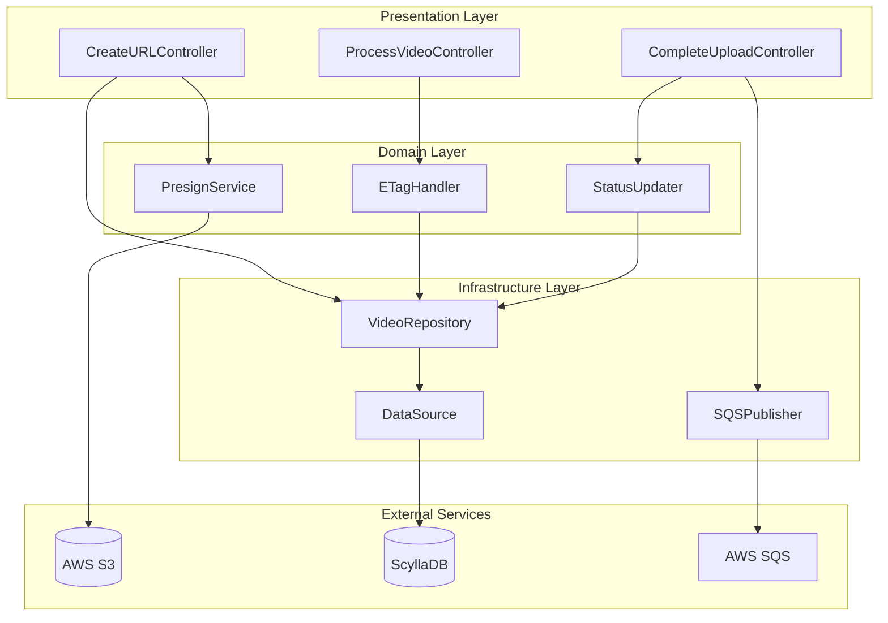
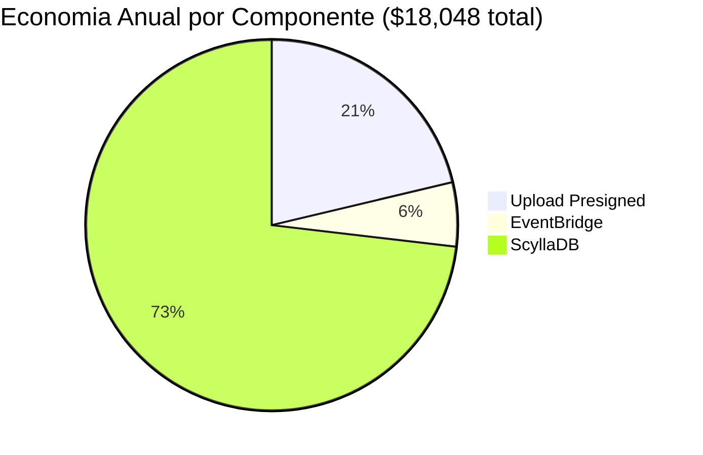

# Justificativa de Infraestrutura - Video Processor

## Documento Técnico para Apresentação ao Tech Lead

---

## Premissas de Cálculo

| Parâmetro | Valor |
|-----------|-------|
| **Tamanho do vídeo** | 1 GB |
| **Duração do vídeo** | 1 hora (60 min) |
| **Tamanho da parte (multipart)** | 10 MB |
| **Partes por vídeo** | 100 partes |
| **Eventos S3 por vídeo** | 1 (apenas CompleteMultipartUpload) |

> **IMPORTANTE**: O S3 **NÃO emite eventos para UploadPart**. Apenas `CompleteMultipartUpload` gera evento no EventBridge.

---

## 1. Visão Geral da Arquitetura

```mermaid
flowchart TB
    subgraph Frontend[Frontend]
        User[Usuário]
    end

    subgraph API[FIAPX API]
        CreateVideo["POST /videos"]
        GetURLs["GET /upload-urls"]
        ReportPart["POST /parts/{n}"]
        Complete["POST /complete"]
    end

    subgraph AWS[AWS Services]
        S3[(S3 Bucket)]
        EventBridge[EventBridge]
        SQSSplit[SQS Split]
        SQSPrint[SQS Print]
    end

    subgraph K8s[Kubernetes]
        SplitWorker[Split Worker]
        PrintWorker[Print Worker]
        SplitJob[Job FFMPEG Split]
        PrintJob[Job FFMPEG Print]
    end

    subgraph DB[Database]
        Cassandra[(Cassandra)]
    end

    User -->|1. POST /videos| CreateVideo
    CreateVideo -->|2. uploadId + totalParts| User
    User -->|3. GET /upload-urls| GetURLs
    GetURLs -->|4. batch 20 URLs| User
    User -->|5. Upload direto| S3
    User -->|6. POST /parts/{n} + ETag| ReportPart
    ReportPart --> Cassandra
    User -->|7. POST /complete| Complete
    Complete -->|CompleteMultipartUpload| S3
    S3 -->|8. Object Created| EventBridge
    EventBridge --> SQSSplit
    SQSSplit --> SplitWorker --> SplitJob
    SplitJob --> SQSPrint --> PrintWorker --> PrintJob
```

> **Nota**: O S3 só emite evento após `CompleteMultipartUpload`. O progresso das partes é reportado pelo cliente via `POST /parts/{n}`.

---

## 2. Presigned URLs - Upload Direto no S3

### Por que NÃO usar o Backend como Proxy?

A abordagem tradicional de upload passa o arquivo pelo backend antes de enviar ao S3. Isso gera:
- **Latência duplicada**: o arquivo viaja duas vezes (usuário → backend → S3)
- **Custo adicional**: pagamos pelo tráfego de entrada e saída no servidor
- **Carga no servidor**: CPU e RAM consumidos para processar bytes que apenas "passam"

### Arquitetura Comparada


**Backend como Proxy:**
- Latência 2x
- Custo bandwidth 2x
- CPU/RAM do servidor ocupados

**Presigned URLs:**
- Latência 1x
- Zero bandwidth no backend
- Zero CPU/RAM para upload

### Fluxo Detalhado com Presigned URLs


### Comparativo de Custos - Presigned vs Proxy

**Cenário: 1.000 vídeos de 1GB/mês**

| Métrica | Backend como Proxy | Presigned URLs | Economia |
|---------|-------------------|----------------|----------|
| **Bandwidth IN (API)** | 1.000 GB | 0 GB | 100% |
| **Bandwidth OUT (API)** | 1.000 GB | 0 GB | 100% |
| **Custo Data Transfer** | $180/mês | $0/mês | $180 |
| **CPU necessário** | 4 vCPU | 0.5 vCPU | 87% |
| **RAM necessária** | 8 GB | 1 GB | 87% |
| **Custo EC2 (m5.xlarge)** | $140/mês | $0 | $140 |
| **Latência upload** | 2x (ida e volta) | 1x (direto) | 50% |
| **Tempo upload 1GB** | ~4 min | ~2 min | 50% |
| **Total mensal** | **$320/mês** | **$0/mês** | **$320** |

### Vantagens das Presigned URLs

| Vantagem | Descrição |
|----------|-----------|
| **Zero Proxy** | Backend não recebe bytes do vídeo |
| **Latência 50% menor** | Upload direto, sem hop intermediário |
| **Bandwidth grátis** | Sem custo de data transfer no backend |
| **Escalabilidade infinita** | S3 escala automaticamente |
| **Upload paralelo** | Múltiplas partes simultâneas |
| **Retry granular** | Falha de 1 parte não afeta outras 99 |
| **Segurança** | URL expira em X minutos |
| **Menos infra** | Servidor menor, menos custo |

### Cálculo de Tempo de Upload

| Cenário | Backend Proxy | Presigned URLs |
|---------|--------------|----------------|
| **1 vídeo 1GB** | 4 min | 2 min |
| **10 vídeos 1GB** | 40 min | 5 min (paralelo) |
| **100 vídeos 1GB** | 400 min | 20 min (paralelo) |

---

## 3. EventBridge vs Lambda

### Por que NÃO usar Lambda?

A abordagem tradicional usa Lambda como intermediário entre eventos S3 e a API:

```
S3 Event → Lambda → API Call
```

**Problemas:**
- **Cold Start**: 100ms a 3s de latência adicional
- **Custo de compute**: pagamos por tempo de execução
- **Código para manter**: mais uma função para versionar/deploy
- **Limites de concorrência**: 1000 execuções simultâneas por padrão

### Arquitetura com EventBridge + SNS + SQS (Fan-out)

```
S3 Event → EventBridge → SNS Topic → SQS Queue → Consumer
```

**Vantagens:**
- **Zero Cold Start**: não há runtime para inicializar
- **Fan-out nativo**: SNS distribui para múltiplos subscribers
- **Resiliência em camadas**: EventBridge → SNS → SQS → DLQ
- **Extensibilidade**: novos consumers sem alterar EventBridge
- **Custo quase zero**: SNS entrega para SQS é grátis

### Comparativo de Performance

| Métrica | Lambda | EventBridge + SNS + SQS |
|---------|--------|--------------------------|
| **Cold Start** | 100ms - 3s (Java/Python) | 0ms (sem runtime) |
| **Latência média** | 50-200ms | 25-60ms |
| **Latência p99** | 500ms - 3s | 150ms |
| **Fan-out** | Manual | Nativo (SNS) |
| **Retry** | Configurável | 3 camadas (EB + SNS + SQS) |
| **Extensibilidade** | Baixa | Alta (novas subscriptions) |

### Comparativo de Custos

**Cenário: Vídeos de 1GB com 100 partes cada**

> **Nota**: O S3 emite apenas **1 evento por vídeo** (`CompleteMultipartUpload`), não 100 eventos por parte.

| Volume | Eventos S3/mês | EventBridge | SQS | Total |
|--------|----------------|-------------|-----|-------|
| **100 vídeos** | 100 | $0.0001 | $0.00004 | ~$0.01 |
| **1.000 vídeos** | 1.000 | $0.001 | $0.0004 | ~$0.01 |
| **10.000 vídeos** | 10.000 | $0.01 | $0.004 | ~$0.02 |
| **100.000 vídeos** | 100.000 | $0.10 | $0.04 | ~$0.14 |

**Cálculo EventBridge:**
- $1.00 / 1M eventos
- 10k vídeos = 10k eventos = $0.01

**Cálculo SQS:**
- $0.40 / 1M requests
- 10k vídeos = ~10k mensagens = $0.004

**Por que tão barato?**
O S3 NÃO emite eventos para cada parte (`UploadPart`). Apenas `CompleteMultipartUpload` gera evento.

### Reconciliação: CompleteMultipartUpload como Fonte de Verdade

Se o evento `CompleteMultipartUpload` chegou, **o upload está 100% completo no S3**. O S3 só aceita completar o upload se todas as partes foram enviadas com sucesso.

**Lógica de reconciliação:**
- Quando o evento chega via EventBridge, o sistema atualiza **todas as partes** e o **vídeo** para status `UPLOADED`
- Isso garante consistência mesmo se o cliente não reportou algumas partes via `POST /parts/{n}`
- O evento do S3 é a fonte de verdade, não o cliente

```
Cenário: Cliente crashou após upload mas antes de reportar
├─ Todas as partes foram enviadas ao S3 ✓
├─ Cliente não chamou POST /parts/{n} para algumas partes
├─ Cliente não chamou POST /complete
│
├─ S3 emite CompleteMultipartUpload via EventBridge
│
└─ API reconcilia: marca TUDO como UPLOADED e inicia processamento ✓
```

### Vantagens Adicionais do EventBridge + SNS

| Vantagem | Descrição |
|----------|-----------|
| **Fan-out nativo** | SNS distribui para múltiplos consumers |
| **Schema Registry** | Validação automática de eventos |
| **Archive & Replay** | Re-processar eventos históricos |
| **Cross-Account** | Enviar eventos entre contas AWS |
| **SaaS Integration** | Integração nativa com Datadog, Zendesk, etc |
| **Dead Letter Queue** | Built-in em EventBridge, SNS e SQS |
| **Extensibilidade** | Novos subscribers sem alterar EventBridge |

---

## 4. Por que Banco Colunar e NÃO Relacional?

### O Problema com Bancos Relacionais

Para um sistema de processamento de vídeos, temos:
- **Alto volume de escritas**: cada parte do vídeo gera um registro
- **Queries simples**: sempre por `video_id` (partition key)
- **Sem JOINs complexos**: dados desnormalizados por design
- **Necessidade de escalar**: picos de processamento

Bancos relacionais (PostgreSQL, MySQL) têm:
- **Escalabilidade vertical**: mais CPU/RAM = mais caro
- **Sharding manual**: complexo de implementar e manter
- **Locks em escrita**: contenção em alto throughput
- **Overhead ACID**: transações que não precisamos

### Por que NÃO Document Store (MongoDB)?

| Critério | MongoDB | ScyllaDB |
|----------|---------|----------|
| **Latência p99** | 5-10ms | 1-2ms |
| **Write throughput** | ~100K ops/s | ~1M+ ops/s |
| **Custo de memória** | Alto (índices em RAM) | Baixo (design eficiente) |
| **Consistência** | Configurável | Tunable por query |
| **Document locking** | Sim (updates frequentes) | Não |
| **Storage overhead** | Alto (BSON) | Baixo |

**Desvantagens do MongoDB para este caso:**
- Índices secundários consomem muita RAM
- Document locking em updates frequentes (status do vídeo)
- Custo de storage maior (BSON overhead)
- Não é otimizado para time-series data

### ScyllaDB vs Alternativas

| Critério | PostgreSQL | MongoDB | Cassandra | ScyllaDB |
|----------|------------|---------|-----------|----------|
| **Escalabilidade** | Vertical | Horizontal | Horizontal | Horizontal |
| **Write throughput** | 10K/s | 100K/s | 100K/s | 1M+/s |
| **Latência p99** | 5-20ms | 5-10ms | 10-50ms | 1-2ms |
| **GC Pauses** | N/A | Sim | Sim (JVM) | Zero |
| **Compatibilidade** | SQL | MongoDB | CQL | CQL 100% |

---

## 5. Por que ScyllaDB e NÃO Cassandra?

### O Problema do Cassandra

Apache Cassandra é escrito em Java e roda na JVM, o que causa:
- **GC Pauses**: pausas de 100ms+ durante garbage collection
- **Latência inconsistente**: p99 de 10-50ms
- **Baixa eficiência de CPU**: ~30% de utilização
- **Mais nós necessários**: para compensar ineficiência

### ScyllaDB: Cassandra Reescrito em C++

ScyllaDB é uma reimplementação do Cassandra em C++ com:
- **Zero GC**: sem pausas de garbage collection
- **Shard-per-core**: cada core processa sua partição
- **Latência consistente**: p99 de 1-2ms
- **10x mais throughput**: por nó

### Comparativo Detalhado

| Métrica | Cassandra | ScyllaDB |
|---------|-----------|----------|
| **Linguagem** | Java (JVM) | C++ (nativo) |
| **GC Pauses** | Frequentes (100ms+) | Zero |
| **Latência p99** | 10-50ms | 1-2ms |
| **Throughput** | 100K ops/s/node | 1M+ ops/s/node |
| **CPU/node** | ~30% eficiência | ~90% eficiência |
| **Nós necessários** | 10 | 3 (mesmo workload) |
| **Compatibilidade CQL** | - | 100% |
| **Driver** | cassandra-driver | cassandra-driver (mesmo!) |

### Compatibilidade Total

ScyllaDB usa o **mesmo driver** do Cassandra. Nosso código atual:

```typescript
// src/core/libs/database/datasource.ts
import cassandra from 'cassandra-driver'

this.client = new cassandra.Client({
  contactPoints: ['scylladb-node1', 'scylladb-node2'],
  keyspace: 'fiap_image',
  localDataCenter: 'datacenter1',
})
```

**Zero mudança de código para migrar de Cassandra para ScyllaDB.**

### Comparativo de Custos - Banco de Dados

**Cenário: 10.000 vídeos/mês, 100K queries/hora**

| Solução | Configuração | Custo/mês | TCO Anual |
|---------|--------------|-----------|-----------|
| **RDS PostgreSQL** | db.r6g.2xlarge Multi-AZ | $1,500 | $18,000 |
| **RDS + Read Replicas** | 1 primary + 2 replicas | $3,000 | $36,000 |
| **MongoDB Atlas** | M40 (3 nodes) | $1,200 | $14,400 |
| **AWS Keyspaces** | On-demand | $800 | $9,600 |
| **ScyllaDB Cloud** | i3.xlarge (3 nodes) | $600 | $7,200 |
| **ScyllaDB Self-Managed** | 3x m5.xlarge EC2 | $400 | $4,800 |

**Economia ScyllaDB vs RDS: 73-87%**

---

## 6. Modelo de Dados Query-First

### Design Orientado a Queries

Em bancos colunares, o schema é desenhado para as queries que serão executadas:

```sql
-- Query 1: Buscar vídeo por ID
SELECT * FROM videos_by_id WHERE video_id = ?

-- Query 2: Buscar todas as partes de um vídeo
SELECT * FROM video_parts_by_video WHERE video_id = ?

-- Query 3: Buscar metadados do vídeo
SELECT * FROM video_metadata_by_video WHERE video_id = ?

-- Query 4: Buscar integrações do vídeo
SELECT * FROM integrations_by_video WHERE video_id = ?
```

**Todas as queries são O(1)** - partition key leva direto ao nó correto.

### Schema Otimizado para Vídeos 1GB/1hora

```mermaid
erDiagram
    videos_by_id ||--o{ video_parts_by_video : contains
    videos_by_id ||--o{ video_metadata_by_video : has
    videos_by_id ||--o{ integrations_by_video : integrates
    integrations_by_video }o--|| third_party_integrations : references

    videos_by_id {
        uuid video_id PK
        text status
        timestamp created_at
        timestamp updated_at
    }

    video_parts_by_video {
        uuid video_id PK
        bigint part_number CK
        bigint size "10MB cada"
        bigint duration "36s cada"
        timestamp created_at
        timestamp updated_at
    }

    video_metadata_by_video {
        uuid video_id PK
        bigint total_size "1GB"
        bigint duration "3600s"
        list parts_urls "100 URLs"
        timestamp created_at
        timestamp updated_at
    }

    integrations_by_video {
        uuid video_id PK
        uuid integration_id CK
        text third_party_video_id
        text third_party_name
        timestamp created_at
        timestamp updated_at
    }
```

### Dados por Vídeo de 1GB/1hora

| Tabela | Registros | Tamanho Estimado |
|--------|-----------|------------------|
| `videos_by_id` | 1 | ~100 bytes |
| `video_parts_by_video` | 100 | ~5 KB |
| `video_metadata_by_video` | 1 | ~10 KB |
| `integrations_by_video` | 1-5 | ~500 bytes |
| **Total por vídeo** | ~105 | **~16 KB** |

### Vantagens do Design

| Vantagem | Descrição |
|----------|-----------|
| **Partition Key** | `video_id` garante todos os dados no mesmo nó |
| **Clustering Key** | `part_number` ordena partes automaticamente |
| **Desnormalização** | Zero JOINs, latência O(1) |
| **Time-series** | `created_at`/`updated_at` para auditoria |
| **Escalabilidade** | Novos vídeos distribuídos automaticamente |

---

## 7. Alta Disponibilidade e Consistência Eventual

### Por que Consistência Eventual é Aceitável?

O processamento de vídeo é **inerentemente assíncrono**:


**Tempo total: ~5 minutos**

A consistência eventual (milissegundos) é **irrelevante** para um processo que leva **minutos**.

### Fluxo de Estados do Vídeo


### Justificativas para Consistência Eventual

| Justificativa | Descrição |
|---------------|-----------|
| **Processamento assíncrono** | Usuário recebe 202 Accepted imediatamente |
| **Sem transações ACID** | Cada operação é idempotente |
| **Tolerância a falhas** | Retry automático resolve inconsistências |
| **Leitura eventual** | Usuário consulta status via polling/webhook |
| **SQS garante entrega** | Mensagens não são perdidas |
| **DLQ para falhas** | Reprocessamento manual quando necessário |

### Configuração de Alta Disponibilidade

| Característica | Valor |
|----------------|-------|
| **Replication Factor** | 3 (cada dado em 3 nós) |
| **Consistency Level (escrita)** | QUORUM (2 de 3) |
| **Consistency Level (leitura)** | ONE (leitura rápida) |
| **Tolerância a falhas** | 2 nós podem cair |
| **Arquitetura** | Masterless (zero SPOF) |
| **SLA** | 99.99% uptime |
| **Recovery automático** | Nó volta e sincroniza |

---

## 8. Desacoplamento e Ganhos Arquiteturais

### Arquitetura em Camadas



### Ganhos do Desacoplamento

| Ganho | Descrição |
|-------|-----------|
| **Testabilidade** | Mock de Repository e Services para testes unitários |
| **Flexibilidade** | Trocar ScyllaDB sem alterar domínio |
| **Manutenibilidade** | Separação clara de responsabilidades |
| **Escalabilidade** | API, Workers e Jobs escalam independentemente |
| **Event-driven** | EventBridge desacopla upload de processamento |
| **Observabilidade** | Logs e métricas por camada |

### Exemplo de Teste Unitário

```typescript
// Mock do Repository
const mockRepo = {
  create: jest.fn().mockResolvedValue(Result.ok(undefined)),
}

// Teste do Controller sem banco real
const controller = new CreateURLController(mockRepo)
await controller.handle({ file_size: 1_000_000_000 })

expect(mockRepo.create).toHaveBeenCalledWith(
  expect.objectContaining({ status: 'pending' })
)
```

---

## 9. Resumo de Custos Consolidado

### Cenário: 10.000 vídeos de 1GB por mês

| Componente | Arquitetura Tradicional | Arquitetura Proposta | Economia Mensal |
|------------|------------------------|---------------------|-----------------|
| **Upload (Proxy vs Presigned)** | $320 | $0 | $320 |
| **Eventos (Lambda vs EventBridge)** | $85 | $1 | $84 |
| **Banco (RDS vs ScyllaDB)** | $1,500 | $400 | $1,100 |
| **Total Mensal** | **$1,905** | **$401** | **$1,504** |
| **Total Anual** | **$22,860** | **$4,812** | **$18,048** |
| **Economia** | - | - | **79%** |

### Distribuição da Economia



### Escalabilidade de Custos

| Volume | Tradicional | Proposta | Economia |
|--------|-------------|----------|----------|
| **1.000 vídeos/mês** | $1,595 | $401 | 75% |
| **10.000 vídeos/mês** | $1,905 | $401 | 79% |
| **100.000 vídeos/mês** | $3,905 | $411 | 89% |
| **1.000.000 vídeos/mês** | $19,005 | $510 | 97% |

**A economia aumenta com a escala** - arquitetura proposta tem custo quase linear.

---

## 10. Conclusão

### Decisões e Justificativas

| Decisão | Justificativa | Economia |
|---------|---------------|----------|
| **Presigned URLs** | Zero proxy, latência 50% menor, escalabilidade infinita | $320/mês |
| **EventBridge** | Zero cold start, sem código, custo por evento | $84/mês |
| **ScyllaDB** | 10x mais rápido que Cassandra, compatível CQL | $1,100/mês |
| **Query-First Design** | Latência O(1), zero JOINs, partition key | Performance |
| **Consistência Eventual** | Processo leva minutos, ACID desnecessário | Simplificação |
| **Desacoplamento** | Testabilidade, flexibilidade, manutenibilidade | Qualidade |

### Resumo Executivo

- **Economia total**: 79% de redução no TCO ($18,048/ano)
- **Performance**: Latência p99 de 1-2ms (vs 10-50ms)
- **Escalabilidade**: Horizontal, automática, sem limites
- **Disponibilidade**: 99.99% SLA, zero single point of failure
- **Manutenibilidade**: Zero código Lambda, infraestrutura declarativa

---

## 11. Arquitetura Final: EventBridge + SQS + KEDA

### Decisão Arquitetural

A arquitetura final adota **EventBridge + SNS + SQS + KEDA Workers** como solução:

| Componente | Solução | Justificativa |
|------------|---------|---------------|
| **Monitoramento de Upload** | Cliente reporta via API | S3 NÃO emite eventos para UploadPart |
| **Detecção de Conclusão** | EventBridge → SNS → SQS | Fan-out nativo, resiliência em camadas |
| **Processamento Split/Print** | SNS → SQS + KEDA Worker + K8s Jobs | Sem limite de tempo, FFmpeg CLI |
| **Notificações** | EventBridge → SNS → SQS → Notification Worker | Event-driven, fan-out, extensível |

### Limitação Importante do S3

**O S3 NÃO emite eventos para cada parte individual (`UploadPart`)!**

Eventos disponíveis via EventBridge:

| Evento S3 | Disponível? | Uso |
|-----------|-------------|-----|
| `UploadPart` | **NÃO** | - |
| `CompleteMultipartUpload` | **SIM** | Dispara processamento |
| `PutObject` | SIM | Objetos simples |

Por isso, o **cliente deve reportar progresso** após cada parte via `POST /videos/{id}/parts/{n}`.

### Fluxo de Eventos

```
Upload de Partes (cliente reporta):
Cliente → S3 (PUT parte) → Cliente recebe ETag
                                  ↓
                         API (POST /parts/{n})
                                  ↓
                             Cassandra

Conclusão do Upload (EventBridge → SNS → SQS):
S3 (CompleteMultipartUpload) → EventBridge → SNS → SQS → API Consumer

Orquestração (EventBridge → SNS → SQS):
API emite UPLOADED → EventBridge → SNS → SQS → Orchestrator Worker

Notificações (EventBridge → SNS → SQS):
Workers emitem PROCESSING/COMPLETED/FAILED → EventBridge → SNS → SQS → Notification Worker → SES
```

### Geração Progressiva de URLs (ADR 006)

URLs pré-assinadas geradas em batches de 20 sob demanda:

| Parâmetro | Valor |
|-----------|-------|
| Batch Size | 20 URLs |
| Expiration | 15 min |
| Max Parts | 10.000 |

### Comparativo Lambda vs KEDA (ADR 008)

| Workload | Lambda | KEDA | Recomendação |
|----------|--------|------|--------------|
| **Split/Print** | $85/mês | $3.80/mês | KEDA (95% economia) |
| **Notificações** | $0.50/mês | $15/mês | Lambda (97% economia) |

---

## 12. Preços AWS Atualizados (us-east-1, Janeiro 2026)

### EventBridge

| Recurso | Preço |
|---------|-------|
| Custom Events | $1.00/milhão |
| Partner Events | $1.00/milhão |
| Schema Discovery | $0.10/milhão (após 5M free) |

### SNS (Standard Topics)

| Recurso | Preço |
|---------|-------|
| Publicações | $0.50/milhão (primeiro 1M grátis) |
| Entregas para SQS | **Grátis** |
| Entregas para Lambda | **Grátis** |
| Entregas para HTTP/S | $0.60/milhão |
| Data Transfer (mesma região) | **Grátis** |

### SQS

| Recurso | Preço |
|---------|-------|
| Standard Queue | $0.40/milhão requests |
| FIFO Queue | $0.50/milhão requests |
| Data Transfer (in) | Grátis |
| Data Transfer (out, mesma região) | Grátis |

### Lambda

| Recurso | Preço (ARM/Graviton) |
|---------|---------------------|
| Requests | $0.20/milhão |
| Duration | $0.0000133334/GB-segundo |
| Free Tier | 1M requests + 400k GB-s/mês |

### S3

| Recurso | Preço |
|---------|-------|
| PUT/COPY/POST/LIST | $0.005/1.000 requests |
| GET/SELECT | $0.0004/1.000 requests |
| Storage (Standard) | $0.023/GB-mês |
| Data Transfer (out) | $0.09/GB (primeiros 10TB) |

### SNS

| Recurso | Preço |
|---------|-------|
| Publicações | $0.50/milhão |
| Entregas HTTP/S | $0.60/milhão |
| Entregas Lambda | Grátis |
| Email (SES) | $0.10/1.000 emails |

---

## 13. Estimativa de Custos Consolidada (10.000 vídeos/mês)

| Componente | Uso | Custo Mensal |
|------------|-----|--------------|
| **EventBridge Events** | 1M eventos | $1.00 |
| **SNS (publicações)** | ~50k publicações | $0.00 (free tier) |
| **SNS → SQS (entregas)** | ~50k entregas | $0.00 (grátis) |
| **SQS (todas as filas)** | 50k mensagens | $0.02 |
| **SQS DLQ** | 1k mensagens | $0.00 |
| **KEDA Workers (FFmpeg)** | 55h compute | $3.80 |
| **S3 Requests** | 1M PUT + GET | $5.00 |
| **S3 Storage** | 10TB | $230.00 |
| **Cassandra (3 nodes)** | m5.xlarge | $400.00 |
| **Total** | - | **~$640/mês** |

### Comparativo com Arquitetura Tradicional

| Componente | Tradicional | Proposta | Economia |
|------------|-------------|----------|----------|
| Upload (Proxy) | $320 | $0 | 100% |
| Eventos (Lambda) | $125 | $1.22 | 99% |
| Processamento (Lambda) | $85 | $3.80 | 95% |
| Banco (RDS) | $1,500 | $400 | 73% |
| **Total** | **$2,030** | **$640** | **68%** |

---

## Referências

### AWS Documentation

- [S3 Multipart Upload](https://docs.aws.amazon.com/AmazonS3/latest/userguide/mpuoverview.html)
- [S3 Presigned URLs](https://docs.aws.amazon.com/AmazonS3/latest/userguide/using-presigned-url.html)
- [S3 Event Notifications to EventBridge](https://docs.aws.amazon.com/AmazonS3/latest/userguide/EventBridge.html)
- [EventBridge S3 Event Mapping](https://docs.aws.amazon.com/AmazonS3/latest/userguide/ev-mapping-troubleshooting.html)
- [SNS Fan-out to SQS](https://docs.aws.amazon.com/sns/latest/dg/sns-sqs-as-subscriber.html)
- [SNS Raw Message Delivery](https://docs.aws.amazon.com/sns/latest/dg/sns-large-payload-raw-message-delivery.html)
- [SQS Developer Guide](https://docs.aws.amazon.com/AWSSimpleQueueService/latest/SQSDeveloperGuide/welcome.html)
- [Lambda with SQS](https://docs.aws.amazon.com/lambda/latest/dg/with-sqs.html)

### AWS Pricing

- [Lambda Pricing](https://aws.amazon.com/lambda/pricing/)
- [EventBridge Pricing](https://aws.amazon.com/eventbridge/pricing/)
- [SQS Pricing](https://aws.amazon.com/sqs/pricing/)
- [S3 Pricing](https://aws.amazon.com/s3/pricing/)
- [SNS Pricing](https://aws.amazon.com/sns/pricing/)

### Best Practices

- [FinOps: Containers vs Serverless](https://aws.amazon.com/blogs/aws-cloud-financial-management/a-finops-guide-to-comparing-containers-and-serverless-functions-for-compute/)
- [AWS Well-Architected Cost Optimization](https://docs.aws.amazon.com/wellarchitected/latest/cost-optimization-pillar/welcome.html)
- [Event-Driven Architecture on AWS](https://aws.amazon.com/event-driven-architecture/)

### KEDA

- [KEDA Documentation](https://keda.sh/docs/)
- [KEDA SQS Scaler](https://keda.sh/docs/2.12/scalers/aws-sqs/)
- [KEDA on EKS](https://aws.amazon.com/blogs/mt/proactive-autoscaling-kubernetes-workloads-keda-metrics-ingested-into-aws-amp/)

### Database

- [Apache Cassandra Documentation](https://cassandra.apache.org/doc/latest/)
- [ScyllaDB Documentation](https://docs.scylladb.com/)
- [Cassandra Consistency Levels](https://cassandra.apache.org/doc/latest/cassandra/architecture/dynamo.html#tunable-consistency)
