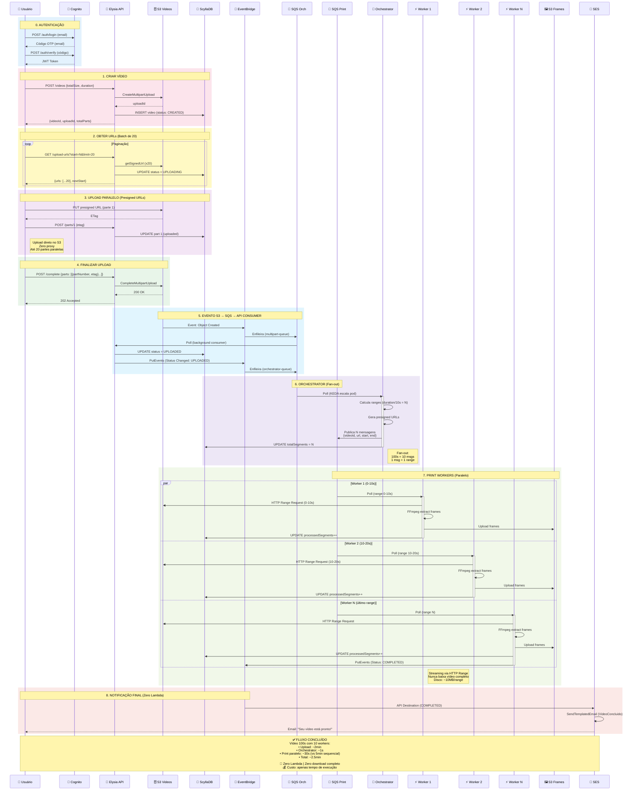

```mermaid
sequenceDiagram
    participant U as 👤 Usuário
    participant C as 🔐 Cognito
    participant API as 📡 Elysia API
    participant S3 as 🗄️ S3 Videos
    participant DB as 💾 ScyllaDB
    participant EB as 🔔 EventBridge
    participant SQSo as 📨 SQS Orch
    participant SQSp as 📨 SQS Print
    participant Orch as 🔄 Orchestrator
    participant W1 as ⚡ Worker 1
    participant W2 as ⚡ Worker 2
    participant WN as ⚡ Worker N
    participant S3F as 🖼️ S3 Frames
    participant SES as 📧 SES

    rect rgb(227, 242, 253)
        Note over U,C: 0. AUTENTICAÇÃO
        U->>C: POST /auth/login (email)
        C-->>U: Código OTP (email)
        U->>C: POST /auth/verify (código)
        C-->>U: JWT Token
    end

    rect rgb(252, 228, 236)
        Note over U,DB: 1. CRIAR VÍDEO
        U->>API: POST /videos {totalSize, duration}
        API->>S3: CreateMultipartUpload
        S3-->>API: uploadId
        API->>DB: INSERT video (status: CREATED)
        API-->>U: {videoId, uploadId, totalParts}
    end

    rect rgb(255, 249, 196)
        Note over U,DB: 2. OBTER URLs (Batch de 20)
        loop Paginação
            U->>API: GET /upload-urls?start=N&limit=20
            API->>S3: getSignedUrl (x20)
            API->>DB: UPDATE status = UPLOADING
            API-->>U: {urls: [...20], nextStart}
        end
    end

    rect rgb(243, 229, 245)
        Note over U,DB: 3. UPLOAD PARALELO (Presigned URLs)
        U->>S3: PUT presigned URL (parte 1)
        S3-->>U: ETag
        U->>API: POST /parts/1 {etag}
        API->>DB: UPDATE part 1 (uploaded)
        Note right of U: Upload direto no S3<br/>Zero proxy<br/>Até 20 partes paralelas
    end

    rect rgb(232, 245, 233)
        Note over U,S3: 4. FINALIZAR UPLOAD
        U->>API: POST /complete {parts: [{partNumber, etag}...]}
        API->>S3: CompleteMultipartUpload
        S3-->>API: 200 OK
        API-->>U: 202 Accepted
    end

    rect rgb(225, 245, 254)
        Note over S3,SQSo: 5. EVENTO S3 → SQS → API CONSUMER
        S3->>EB: Event: Object Created
        EB->>SQSo: Enfileira (multipart-queue)
        SQSo->>API: Poll (background consumer)
        API->>DB: UPDATE status = UPLOADED
        API->>EB: PutEvents (Status Changed: UPLOADED)
        EB->>SQSo: Enfileira (orchestrator-queue)
    end

    rect rgb(237, 231, 246)
        Note over SQSo,SQSp: 6. ORCHESTRATOR (Fan-out)
        SQSo->>Orch: Poll (KEDA escala pod)
        activate Orch
        Orch->>Orch: Calcula ranges (duration/10s = N)
        Orch->>Orch: Gera presigned URLs
        Orch->>SQSp: Publica N mensagens<br/>{videoId, url, start, end}
        Orch->>DB: UPDATE totalSegments = N
        deactivate Orch
        Note right of Orch: Fan-out:<br/>100s = 10 msgs<br/>1 msg = 1 range
    end

    rect rgb(241, 248, 233)
        Note over SQSp,S3F: 7. PRINT WORKERS (Paralelo)
        par Worker 1 (0-10s)
            SQSp->>W1: Poll (range 0-10s)
            activate W1
            W1->>S3: HTTP Range Request (0-10s)
            W1->>W1: FFmpeg extract frames
            W1->>S3F: Upload frames
            W1->>DB: UPDATE processedSegments++
            deactivate W1
        and Worker 2 (10-20s)
            SQSp->>W2: Poll (range 10-20s)
            activate W2
            W2->>S3: HTTP Range Request (10-20s)
            W2->>W2: FFmpeg extract frames
            W2->>S3F: Upload frames
            W2->>DB: UPDATE processedSegments++
            deactivate W2
        and Worker N (último range)
            SQSp->>WN: Poll (range N)
            activate WN
            WN->>S3: HTTP Range Request
            WN->>WN: FFmpeg extract frames
            WN->>S3F: Upload frames
            WN->>DB: UPDATE processedSegments++
            WN->>EB: PutEvents (Status: COMPLETED)
            deactivate WN
        end
        Note right of W1: Streaming via HTTP Range<br/>Nunca baixa vídeo completo<br/>Disco: ~10MB/range
    end

    rect rgb(251, 233, 231)
        Note over EB,U: 8. NOTIFICAÇÃO FINAL (Zero Lambda)
        EB->>SES: API Destination (COMPLETED)
        SES->>SES: SendTemplatedEmail (VideoConcluido)
        SES-->>U: Email: "Seu vídeo está pronto!"
    end

    Note over U,SES: ✅ FLUXO CONCLUÍDO<br/>Vídeo 100s com 10 workers:<br/>• Upload: ~2min<br/>• Orchestrator: ~1s<br/>• Print paralelo: ~30s (vs 5min sequencial)<br/>• Total: ~2.5min<br/><br/>🎯 Zero Lambda | Zero download completo<br/>💰 Custo: apenas tempo de execução
```